# EC2 Web Server

My first AWS project. I launched a Linux server on EC2, installed Apache, and opened it in the browser. Nothing fancy — just getting comfortable with the basics.

## What I built

A simple web server running on an EC2 instance. You type the public IP in the browser and get a page back. That's it.

```
Browser
  |
  | HTTP (port 80)
  v
Internet
  |
  v
Security Group  ← controls what traffic gets in
  |
  v
EC2 Instance (Amazon Linux 2023)
  |
  v
Apache (httpd)
```

## Services used

| Service        | What I used it for                          |
|----------------|---------------------------------------------|
| EC2            | The virtual server                          |
| Security Group | Firewall — opened port 22 (SSH) and 80 (HTTP) |
| Key Pair       | SSH login to the instance                   |

## Resources I created

| Resource       | Value             |
|----------------|-------------------|
| Region         | ap-south-1a       |
| AMI            | Amazon Linux 2023 |
| Instance type  | t2.micro          |
| Key pair       | masterkey.pem     |
| Security group | ec2-web-server-sg |
| Public IP      |  3.110.120.197    |

---

## Steps

### 1. Opened the EC2 Console

Went to the AWS Console, searched for EC2, and opened the dashboard. Made sure I was in the right region.

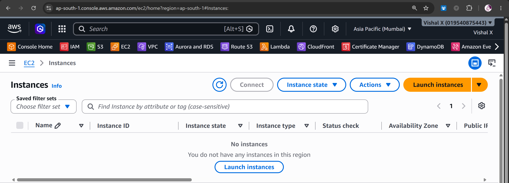

---

### 2. Picked an AMI

Clicked **Launch Instance**, gave it the name `ec2-web-server`, and chose **Amazon Linux 2023**. It's free tier and works well for this kind of thing.

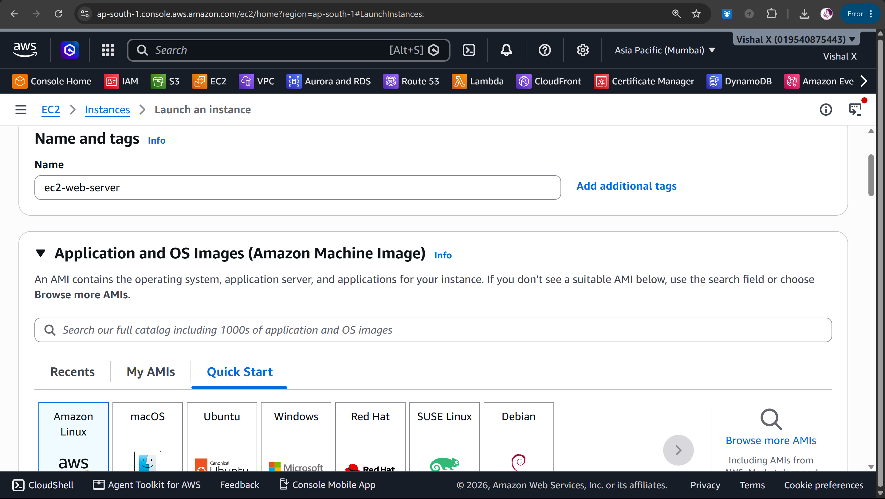

---

### 3. Chose instance type

Went with **t2.micro** — free tier eligible, more than enough for a basic web server.

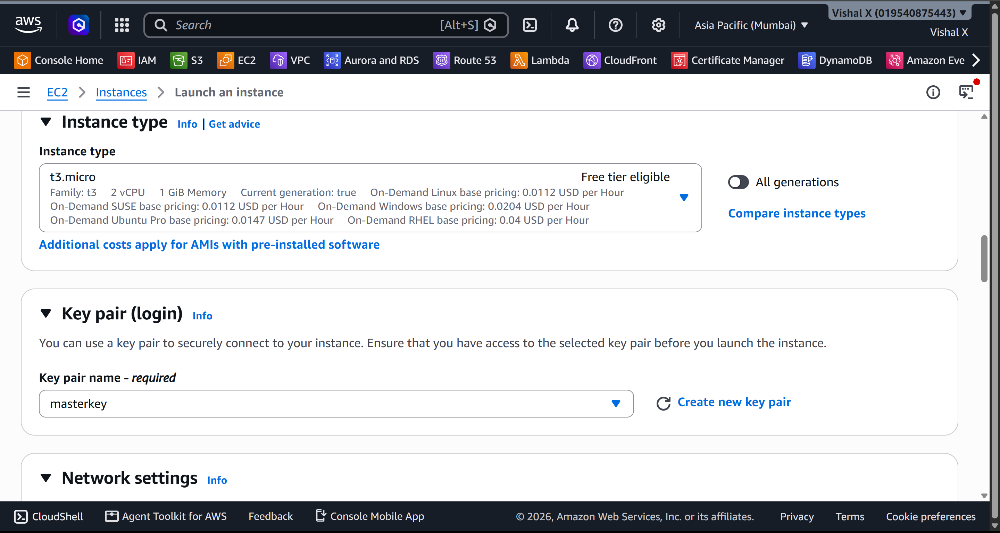

---

### 4. Created a key pair

Created a new key pair called `masterkey.pem`, downloaded the `.pem` file, and saved it somewhere safe. You only get to download it once.

> The `.pem` file is in `.gitignore` so it never gets committed.


---

### 5. Set up the security group

Named it `ec2-web-server-sg`. Added two inbound rules:

| Type | Port | Source    | Why                        |
|------|------|-----------|----------------------------|
| SSH  | 22   | My IP     | So I can connect via SSH   |
| HTTP | 80   | 0.0.0.0/0 | So anyone can view the page |

I used **My IP** for SSH instead of opening it to the world — better habit.

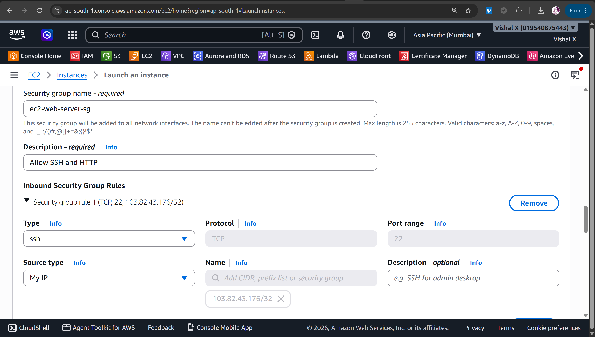

---

### 6. Launched the instance

Left storage as default (8 GiB), reviewed the summary, and hit **Launch instance**.

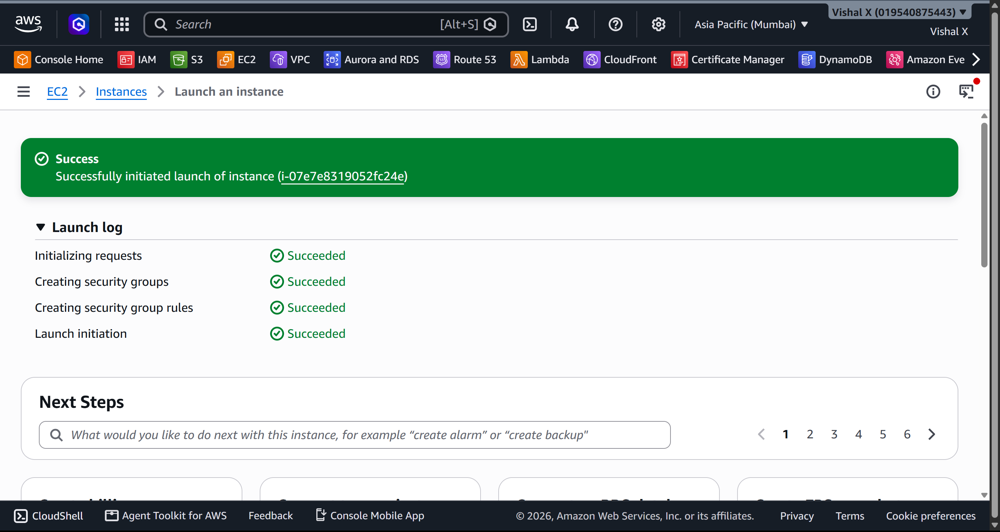

---

### 7. Waited for it to be ready

Watched the instance go from `Pending` to `Running`. Waited for **2/2 status checks** to pass before doing anything else. Copied the public IP.

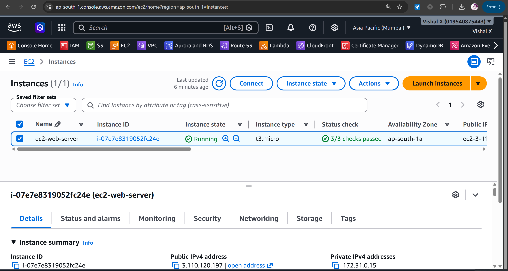

---

### 8. Connected via SSH

From Command prompt on Windows:

```CMD
ssh -i "masterkey.pem" ec2-user@3.110.120.197
```

On Mac/Linux, you need to fix the key permissions first:

```bash
chmod 400 masterkey.pem
ssh -i "masterkey.pem" ec2-user@3.110.120.197
```

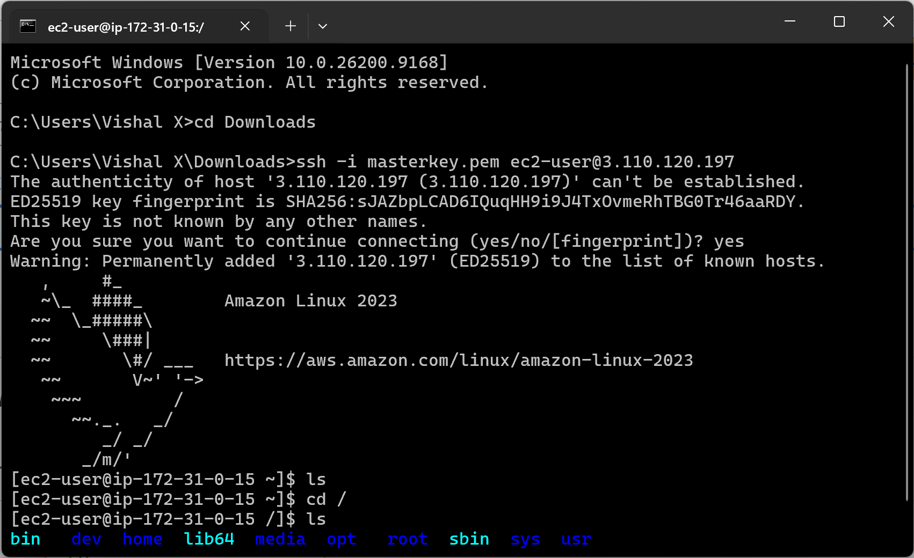

---

### 9. Installed Apache

```bash
sudo yum update -y
sudo yum install httpd -y
```

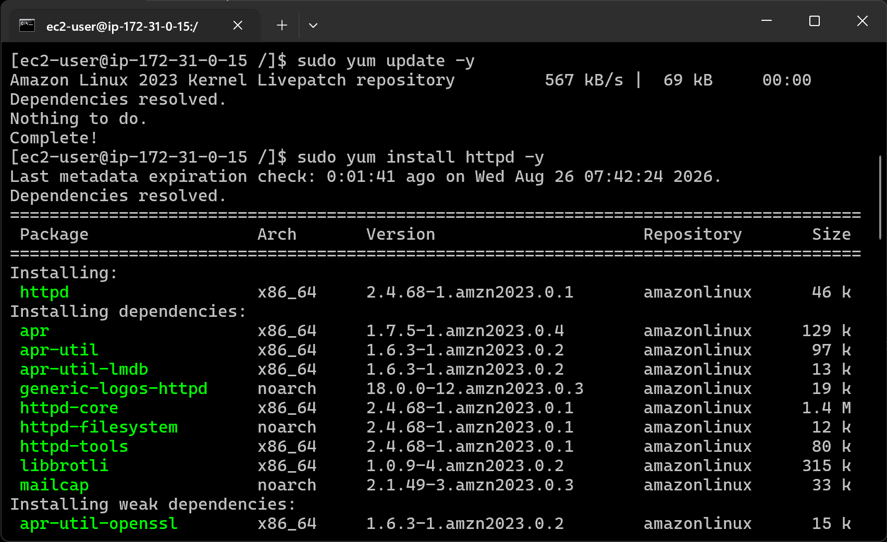

---

### 10. Started Apache

```bash
sudo systemctl start httpd
sudo systemctl enable httpd
sudo systemctl status httpd
```

`enable` makes it start automatically if the instance reboots. `status` confirmed it was `active (running)`.

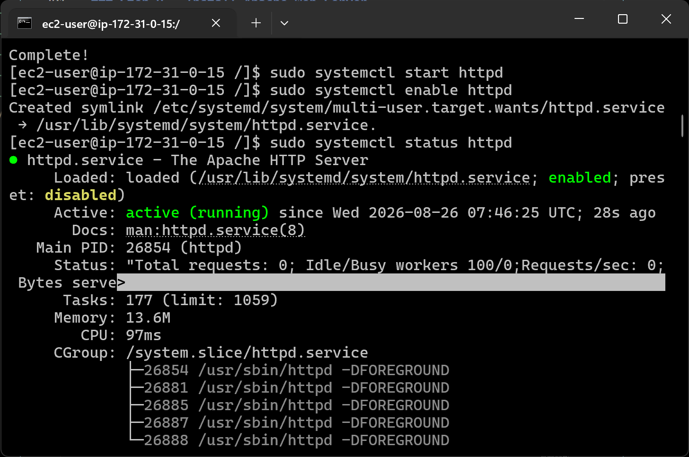

---

### 11. Created a test page

```bash
echo "<h1>Hello from EC2\!</h1>" | sudo tee /var/www/html/index.html
```

---

### 12. Tested in the browser

Opened `http://3.110.120.197/` — the page loaded. Used `http://` not `https://` since there's no SSL set up here.

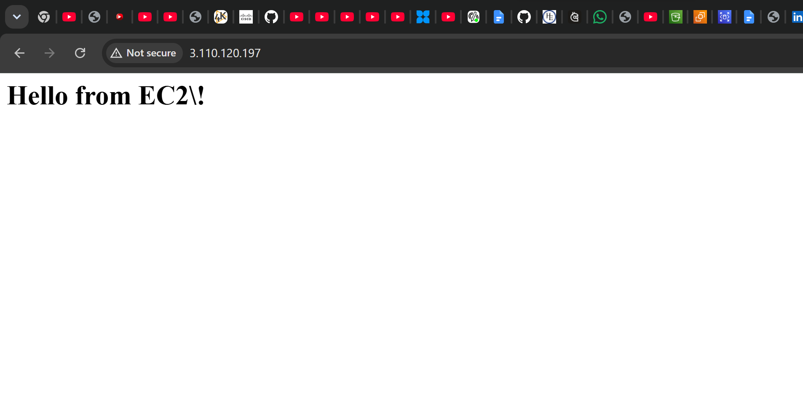

---

### 13. Cleaned up

Terminated the instance from the console: **EC2 → Instances → Terminate instance**. Always do this after testing to avoid charges.

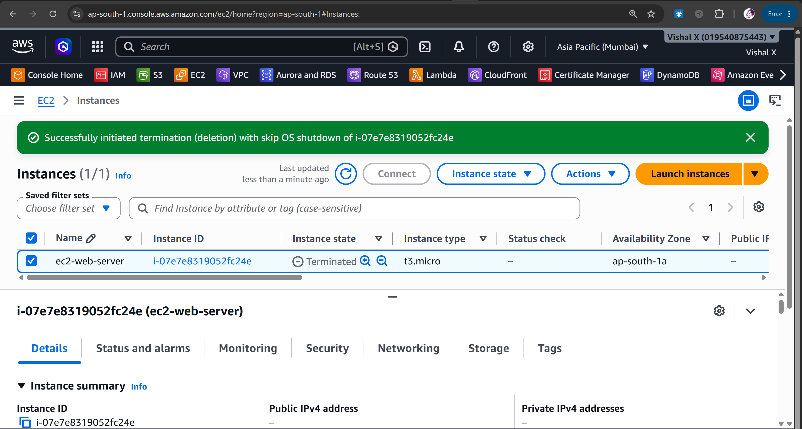

---

## Commands

All commands are in [commands/commands.md](./commands/commands.md)

---

## Things that can go wrong

| Problem | What caused it | How I fixed it |
|---------|----------------|----------------|
| SSH times out | Port 22 not open | Added SSH rule to security group |
| Browser won't load | Port 80 not open | Added HTTP rule to security group |
| Permission denied on SSH | Key file permissions wrong | Ran `chmod 400` on the `.pem` file |
| Page not found | Apache not started | Ran `sudo systemctl start httpd` |

---

## Security notes

- SSH is locked to my IP only, not open to everyone
- The `.pem` key is in `.gitignore` and never pushed to GitHub
- For a real production server I'd add HTTPS and restrict SSH further

---

## Cost

Stayed within free tier the whole time. t2.micro gives you 750 hours/month free. Just make sure to terminate the instance when you're done.

---

## What I learned

- How to launch an EC2 instance from scratch
- What an AMI is and why you pick Amazon Linux for simple projects
- How security groups work as a firewall
- How to SSH into a Linux server from Windows
- How to install and run Apache on Amazon Linux
- That you have to use `http://` not `https://` unless you set up a certificate

---

## Final result


