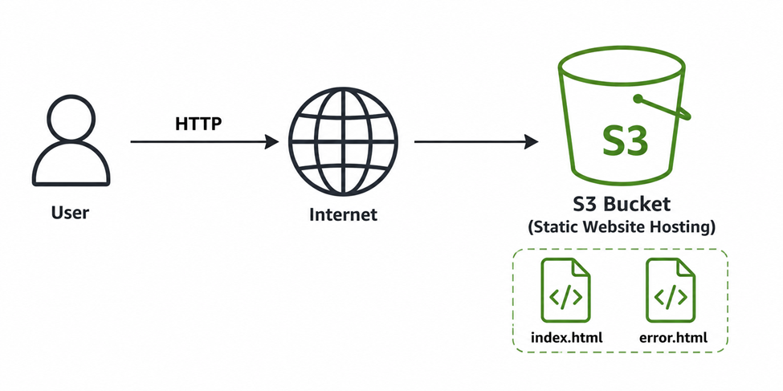
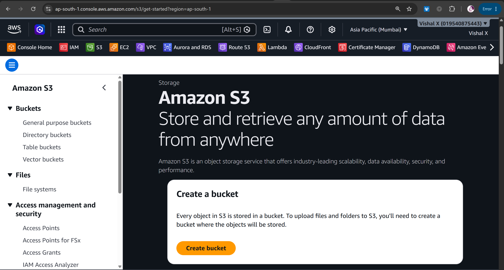
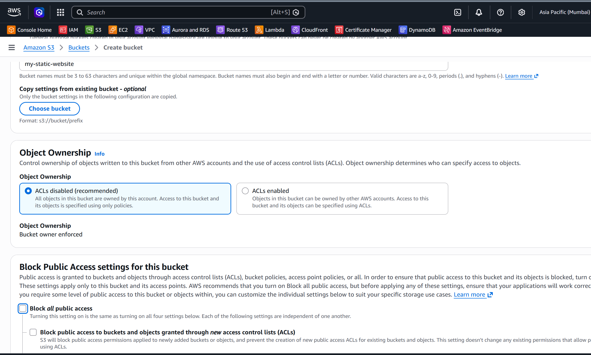
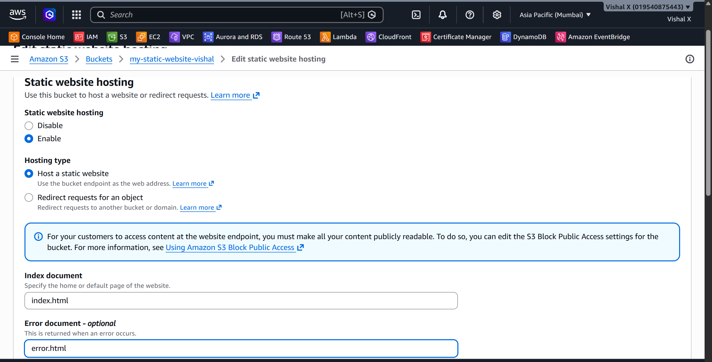
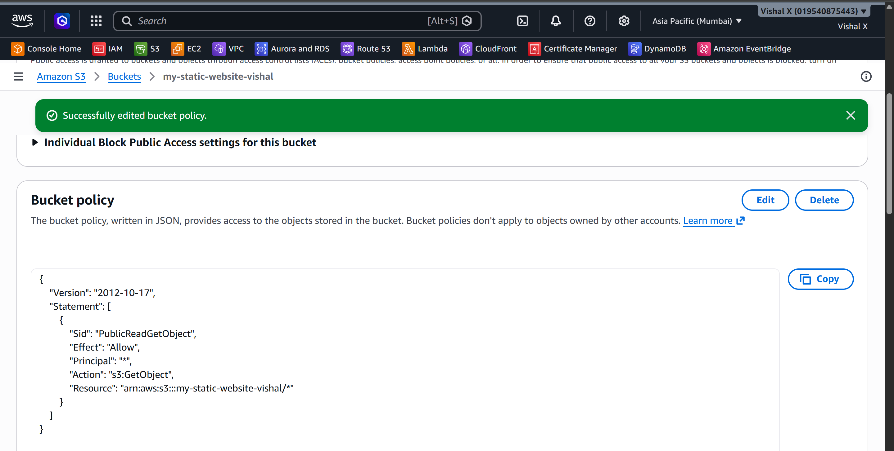
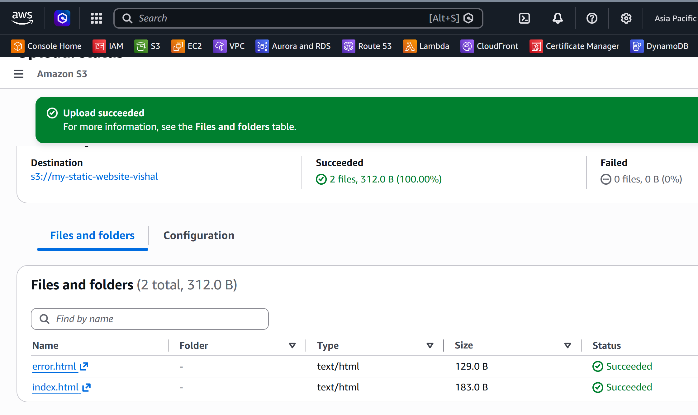
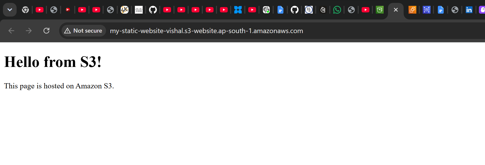
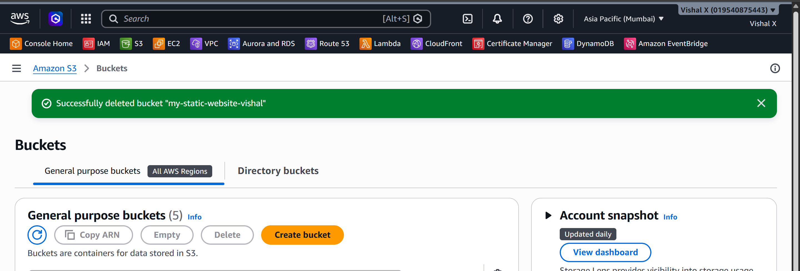

# S3 Static Website

Second project. This time no servers — just uploaded HTML files to S3 and made them publicly accessible as a website. Much simpler than EC2 for hosting static content.

## What I built

A static website hosted entirely on S3. No EC2, no web server to manage. Just an S3 bucket with static website hosting turned on.



## Services used

| Service | What I used it for                  |
|---------|-------------------------------------|
| S3      | Storing and serving the HTML files  |

## Resources I created

| Resource    | Value              |
|-------------|--------------------|
| Region      | ap-south-1        |
| Bucket name | my-static-website-vishal   |
| Website URL | http://my-static-website-vishal.s3-website.ap-south-1.amazonaws.com/   |

---

## Steps

### 1. Opened S3 Console

Went to the AWS Console and searched for S3.



---

### 2. Created a bucket

Clicked **Create bucket**. A few things to note here:
- Bucket name has to be globally unique across all of AWS
- I picked the same region I've been using
- **Unchecked** "Block all public access" — needed for a public website
- Acknowledged the warning about public access



---

### 3. Enabled static website hosting

After the bucket was created, went to **Properties → Static website hosting → Edit**.

- Enabled it
- Index document: `index.html`
- Error document: `error.html`
- Saved

AWS gave me a bucket website endpoint URL at the bottom of that page. Copied it.



---

### 4. Added a bucket policy

By default even with public access unblocked, objects aren't public. Had to add a bucket policy to allow everyone to read the files.

Went to **Permissions → Bucket policy → Edit** and added:

```json
{
  "Version": "2012-10-17",
  "Statement": [
    {
      "Sid": "PublicReadGetObject",
      "Effect": "Allow",
      "Principal": "*",
      "Action": "s3:GetObject",
      "Resource": "arn:aws:s3:::my-static-website-vishal/*"
    }
  ]
}
```




---

### 5. Created the website files

Made a simple `index.html` and `error.html` on my local machine.

**index.html**
```html
<!DOCTYPE html>
<html>
  <head>
    <title>My S3 Website</title>
  </head>
  <body>
    <h1>Hello from S3!</h1>
    <p>This page is hosted on Amazon S3.</p>
  </body>
</html>
```

**error.html**
```html
<!DOCTYPE html>
<html>
  <head>
    <title>Error</title>
  </head>
  <body>
    <h1>Page not found</h1>
  </body>
</html>
```

---

### 6. Uploaded the files

Went to the bucket → **Upload → Add files**, selected both HTML files, and clicked **Upload**.



---

### 7. Tested in the browser

Opened the website endpoint URL from Step 3. The page loaded.



---

### 8. Cleaned up

Deleted everything to avoid storage charges:
1. Selected all objects in the bucket → **Delete**
2. Went to bucket settings → **Delete bucket**



---


## Commands

See [commands/commands.md](./commands/commands.md)

---

## Things that can go wrong

| Problem | What caused it | How I fixed it |
|---------|----------------|----------------|
| 403 Forbidden | Public access still blocked | Unchecked "Block all public access" on the bucket |
| 403 Forbidden | No bucket policy | Added the `s3:GetObject` policy |
| Page not found | Wrong index document name | Made sure the file is named exactly `index.html` |
| URL not working | Using wrong URL | Used the S3 website endpoint, not the bucket URL |

---

## Security notes

- This bucket is intentionally public — that's the point of a static website
- Never put sensitive files in a public bucket
- For a real project I'd put CloudFront in front of S3 and use HTTPS

---

## Cost

S3 is very cheap for static websites. Free tier includes 5 GB storage and 20,000 GET requests/month. For a small personal site the cost is basically zero.

---

## What I learned

- How S3 buckets work and how to create one
- That bucket names have to be globally unique
- How static website hosting works on S3
- What a bucket policy is and why you need one for public access
- The difference between the S3 bucket URL and the website endpoint URL
- That S3 is way simpler than EC2 for hosting static content

---

## Final result


