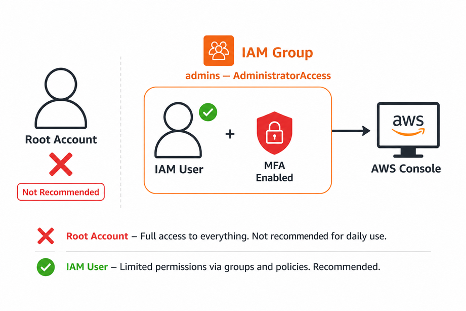
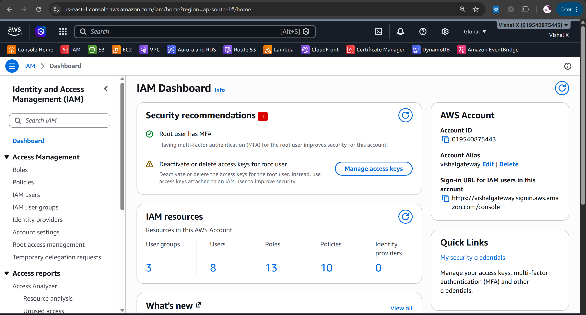
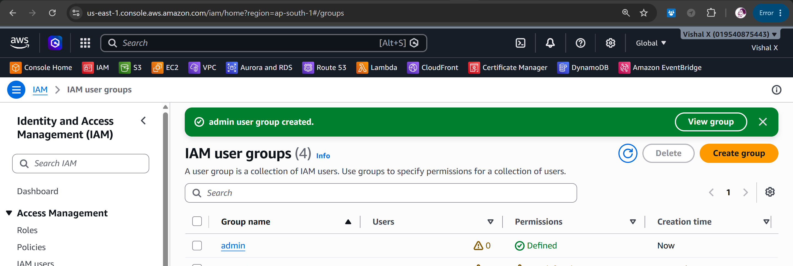
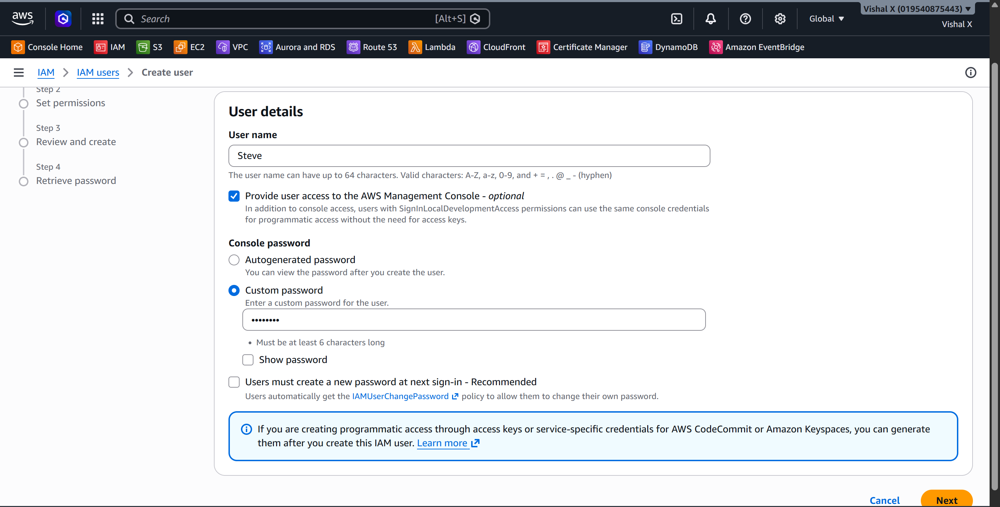
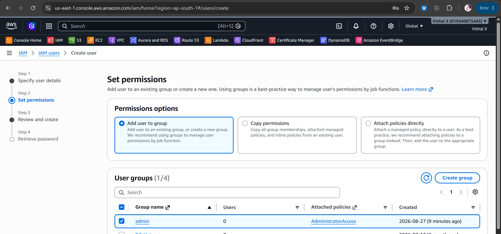
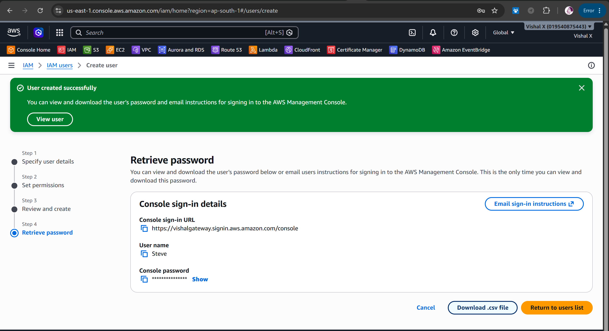
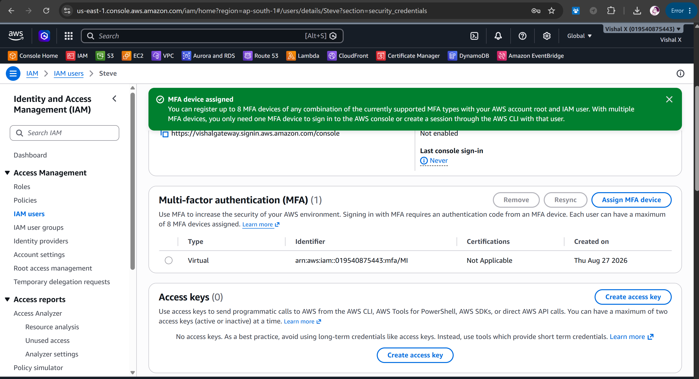
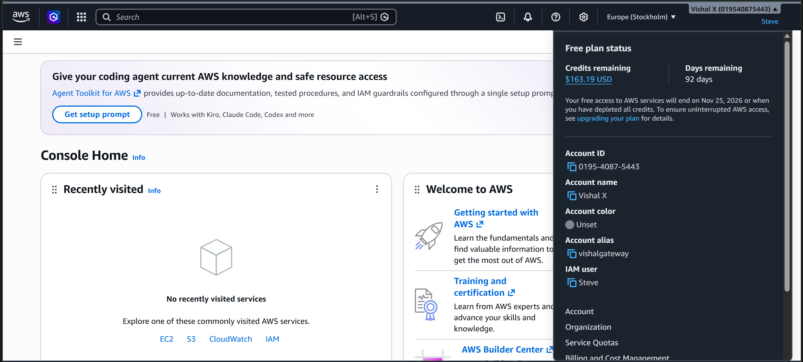
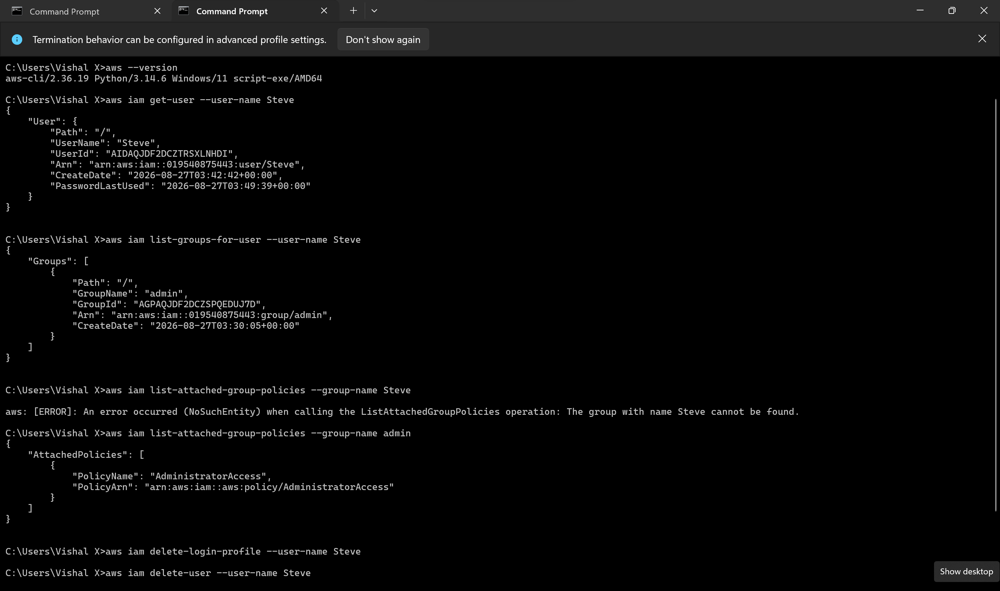

# Secure IAM User

Third project. This one is about security. I created a proper IAM user instead of using the root account, added the user to a group with the right permissions, and enabled MFA. Basic stuff but really important to get right early.

## What I built

A secure IAM setup with:
- A dedicated IAM user for day-to-day work
- An IAM group with least-privilege permissions
- MFA enabled on the IAM user
- Root account locked away and not used

## Why this matters

Using the root account for everything is a bad habit. If the root account gets compromised, everything is gone. IAM users let you control exactly what each person or service can do.

## Services used

| Service | What I used it for                        |
|---------|-------------------------------------------|
| IAM     | Creating users, groups, and policies      |
| MFA     | Adding a second factor to the IAM user    |

## Resources I created

| Resource   | Value                  |
|------------|------------------------|
| IAM user   | Steve      |
| IAM group  | admin        |
| Policy     | AdministratorAccess  |
| MFA device | Virtual MFA (google authenticator) |

---

## Steps

### 1. Opened IAM Console

Went to the AWS Console and searched for IAM.

---

### 2. Created an IAM group

Created a group first, then I'll add the user to it. This way permissions are managed at the group level, not per user.

1. IAM → **User groups → Create group**
2. Group name: admin 
3. Under **Attach permissions policies**, searched for and selected **AdministratorAccess**
4. Clicked **Create user group**

---

### 3. Created an IAM user

1. IAM → **Users → Create user**
2. Username: Steve
3. Checked **Provide user access to the AWS Management Console**
4. Selected **I want to create an IAM user**
5. Set a custom password
6. Unchecked "User must create a new password at next sign-in" (optional)
7. Clicked **Next**

---

### 4. Added user to the group

On the permissions page:
1. Selected **Add user to group**
2. Checked the group I just created
3. Clicked **Next → Create user**

---

### 5. Saved the sign-in details

After the user was created, AWS showed the sign-in URL and credentials. Downloaded or copied them.

> ⚠️ This is the only time you see the password — save it somewhere safe.

---

### 6. Enabled MFA on the IAM user

MFA adds a second layer of security. Even if someone gets the password, they still can't log in without the MFA code.

1. Went to **IAM → Users → Steve → Security credentials**
2. Under **Multi-factor authentication (MFA)**, clicked **Assign MFA device**
3. Device name: anything
4. MFA device type: **Authenticator app**
5. Opened Google Authenticator on my phone
6. Scanned the QR code
7. Entered two consecutive MFA codes to verify
8. Clicked **Add MFA**

---

### 7. Tested the IAM user login

1. Opened the IAM sign-in URL (format: `https://vishalgateway.signin.aws.amazon.com/console`)
2. Logged in with the IAM username and password
3. Entered the MFA code from the authenticator app
4. Confirmed I was logged in as the IAM user, not root

---

### 8. Cleaned up

To remove the IAM user after testing:
1. IAM → **Users → Steve**
2. **Delete user** — confirm deletion
3. IAM → **User groups → admin → Delete**

---

## Screenshots

| # | File | Description |
|---|------|-------------|
| 01 | `screenshots/01-iam-console.png` | IAM Console |
| 02 | `screenshots/02-create-group.png` | Group creation |
| 03 | `screenshots/03-create-user.png` | User creation |
| 04 | `screenshots/04-add-to-group.png` | User added to group |
| 05 | `screenshots/05-user-created.png` | User created successfully |
| 06 | `screenshots/06-mfa-enabled.png` | MFA enabled |
| 07 | `screenshots/07-iam-login.png` | Logged in as IAM user |
| 08 | `screenshots/08-cleanup.png` | Cleanup done |

## Commands

See [commands/commands.md](./commands/commands.md)

---

## Things that can go wrong

| Problem | What caused it | How I fixed it |
|---------|----------------|----------------|
| Can't log in as IAM user | Wrong sign-in URL | Used the account-specific IAM sign-in URL, not the root URL |
| MFA code not working | Phone time out of sync | Synced time on my phone |
| Access denied after login | Wrong policy on group | Checked the group has the right policy attached |
| Can't delete user | User has active access keys | Deleted access keys first under Security credentials |

---

## Security notes

- Root account should only be used for billing and account-level tasks
- Always use IAM users for day-to-day work
- MFA should be enabled on both root and IAM users
- Use least-privilege — only give users the permissions they actually need
- Never share IAM credentials or commit them to GitHub

---

## Cost

IAM is completely free. No charges for users, groups, policies, or MFA devices.

---

## What I learned

- Why you should never use the root account for daily work
- How IAM users and groups work
- How to attach policies to a group instead of individual users
- How MFA works and how to set it up with an authenticator app
- What least-privilege means and why it matters

---

## Final result

