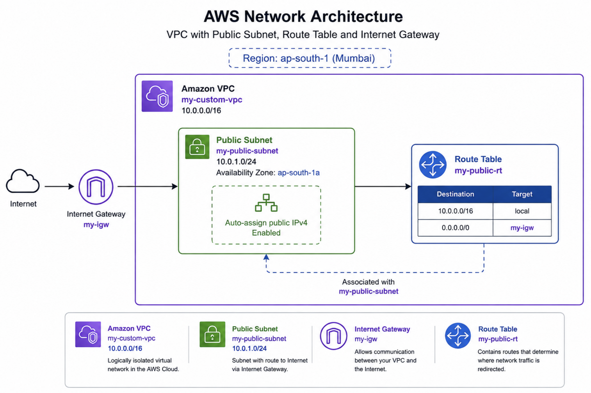
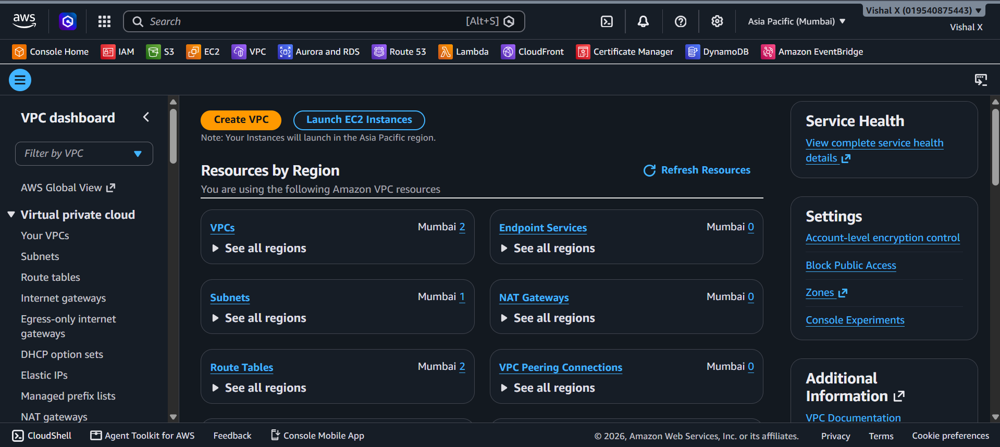
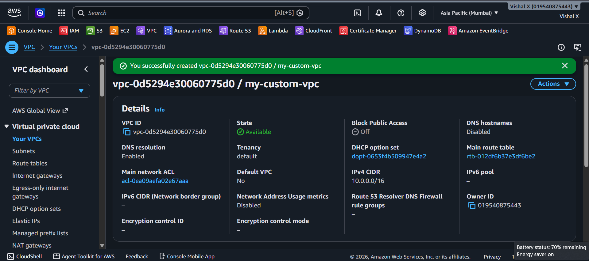
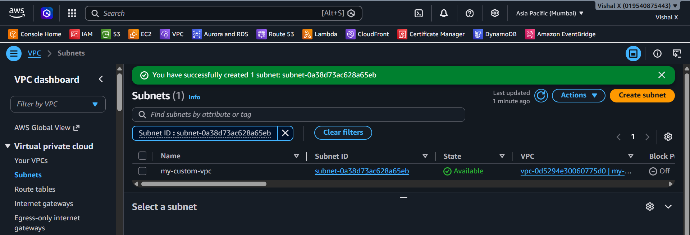
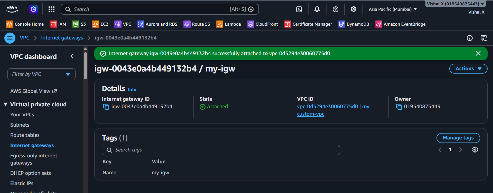
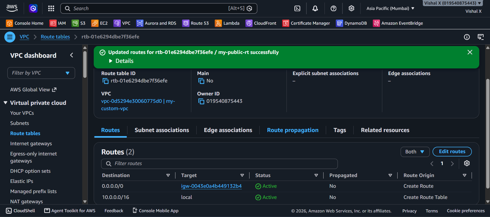
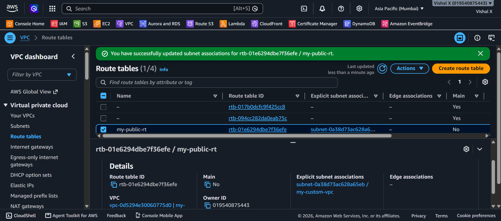
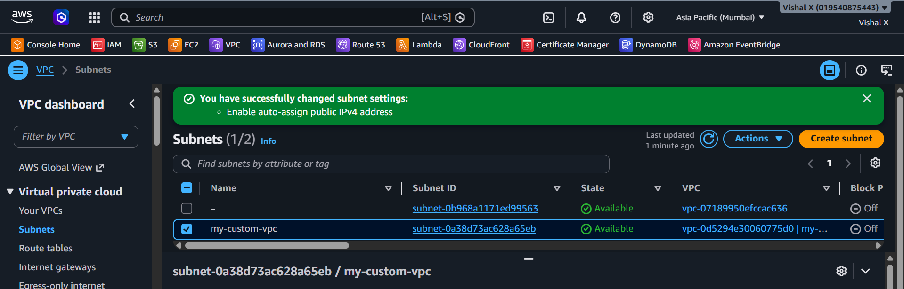
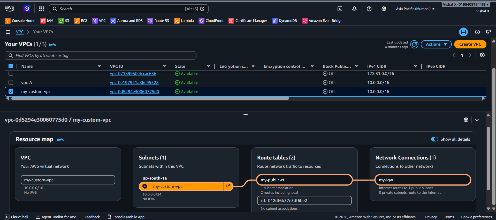
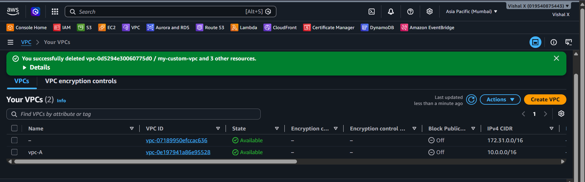

# Custom VPC

Fourth project. This one took a bit more thinking than the others. I built a VPC from scratch — custom IP range, a public subnet, an internet gateway, and a route table to connect everything. No EC2 yet, just the network layer.

## What I built

A custom VPC with one public subnet that can reach the internet.

## Why this matters

By default AWS gives you a default VPC in every region. It works but it's not something you configured yourself. Building a custom VPC teaches you how networking actually works on AWS — IP ranges, subnets, routing, and gateways.

## Services used

| Service          | What I used it for                              |
|------------------|-------------------------------------------------|
| VPC              | Isolated private network for my AWS resources   |
| Subnet           | A segment of the VPC in one availability zone   |
| Internet Gateway | Connects the VPC to the internet                |
| Route Table      | Rules that control where network traffic goes   |

## Resources I created

| Resource         | Value                  |
|------------------|------------------------|
| Region           | ap-south-1          |
| VPC              | my-custom-vpc          |
| VPC CIDR         | 10.0.0.0/16            |
| Public Subnet    | my-public-subnet       |
| Subnet CIDR      | 10.0.1.0/24            |
| Internet Gateway | my-igw                 |
| Route Table      | my-public-rt           |

---

## Steps

### 1. Opened VPC Console

Went to the AWS Console and searched for VPC.

---

### 2. Created a VPC

1. VPC Console → **Your VPCs → Create VPC**
2. Selected **VPC only**
3. Name: `my-custom-vpc`
4. IPv4 CIDR: `10.0.0.0/16` — this gives me 65,536 IP addresses to work with
5. Left everything else as default
6. Clicked **Create VPC**

---

### 3. Created a public subnet

A subnet is a smaller network inside the VPC. I created one public subnet in a single availability zone.

1. VPC Console → **Subnets → Create subnet**
2. VPC: selected `my-custom-vpc`
3. Subnet name: `my-public-subnet`
4. Availability zone: ap-south-1a
5. IPv4 CIDR: `10.0.1.0/24` — gives 256 addresses in this subnet
6. Clicked **Create subnet**

---

### 4. Created an Internet Gateway

Without an internet gateway the VPC is completely isolated — nothing can reach the internet.

1. VPC Console → **Internet gateways → Create internet gateway**
2. Name: `my-igw`
3. Clicked **Create internet gateway**
4. Then clicked **Actions → Attach to VPC**
5. Selected `my-custom-vpc` and clicked **Attach**

---

### 5. Created a Route Table

A route table tells the subnet where to send traffic. I created a custom one and added a route to the internet gateway.

1. VPC Console → **Route tables → Create route table**
2. Name: `my-public-rt`
3. VPC: `my-custom-vpc`
4. Clicked **Create route table**

Then added a route to the internet:
1. Selected `my-public-rt` → **Routes → Edit routes**
2. Clicked **Add route**
3. Destination: `0.0.0.0/0` (all traffic)
4. Target: selected the internet gateway `my-igw`
5. Clicked **Save changes**

---

### 6. Associated the Route Table with the Subnet

The route table doesn't do anything until it's linked to a subnet.

1. Selected `my-public-rt` → **Subnet associations → Edit subnet associations**
2. Checked `my-public-subnet`
3. Clicked **Save associations**

---

### 7. Enabled Auto-assign Public IP on the Subnet

So that any EC2 instance launched in this subnet automatically gets a public IP.

1. VPC Console → **Subnets → my-public-subnet**
2. **Actions → Edit subnet settings**
3. Checked **Enable auto-assign public IPv4 address**
4. Clicked **Save**

---

### 8. Verified the setup

Went through each resource to confirm everything was connected:
- VPC exists with correct CIDR
- Subnet is inside the VPC
- Internet gateway is attached to the VPC
- Route table has the 0.0.0.0/0 route
- Route table is associated with the subnet

---

### 9. Cleaned up

Deleted everything in this order (order matters — you can't delete a VPC that still has resources):

1. Detach and delete the Internet Gateway
2. Delete the Subnet
3. Delete the Route Table (the custom one, not the main one)
4. Delete the VPC

---

## Commands

See [commands/commands.md](./commands/commands.md)

---

## Things that can go wrong

| Problem | What caused it | How I fixed it |
|---------|----------------|----------------|
| Can't delete VPC | Still has subnets or IGW attached | Deleted subnet and detached IGW first |
| Subnet not reachable | Route table not associated | Associated the route table to the subnet |
| No internet access | IGW not attached or route missing | Attached IGW to VPC and added 0.0.0.0/0 route |
| EC2 has no public IP | Auto-assign not enabled on subnet | Enabled auto-assign public IPv4 on the subnet |

---

## Security notes

- This VPC only has a public subnet — for production you'd also add private subnets
- Resources in the public subnet are reachable from the internet — use security groups to control access
- A private subnet would have no route to the internet gateway — used for databases and internal services

---

## Cost

VPC itself is free. Internet gateway has a small hourly charge (~$0.005/hr) plus data transfer costs. For this project the cost is minimal — i just terminated everything after testing.

---

## What I learned

- What a VPC is and why you'd create a custom one
- How CIDR blocks work for IP address ranges
- What subnets are and how they divide a VPC
- What an internet gateway does and why you need one
- How route tables control traffic flow
- The order you have to delete VPC resources

---

## Final result

