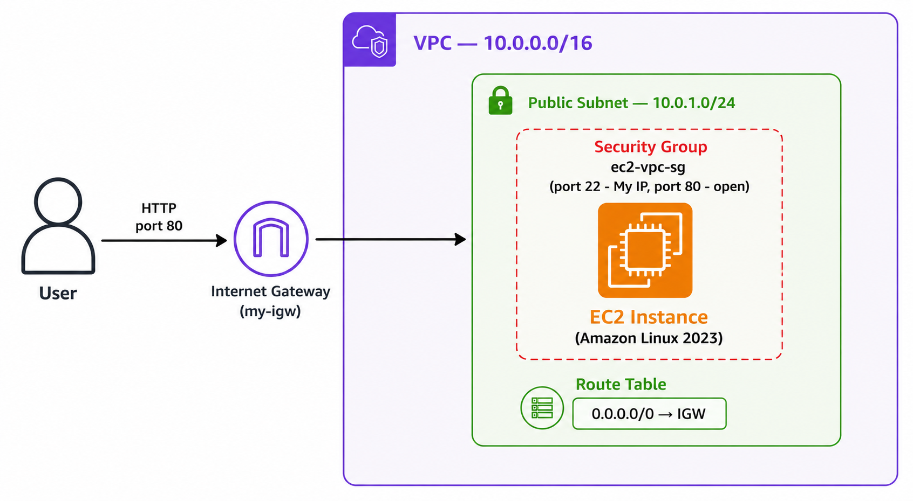
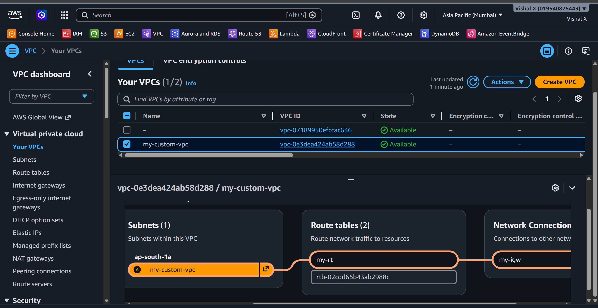
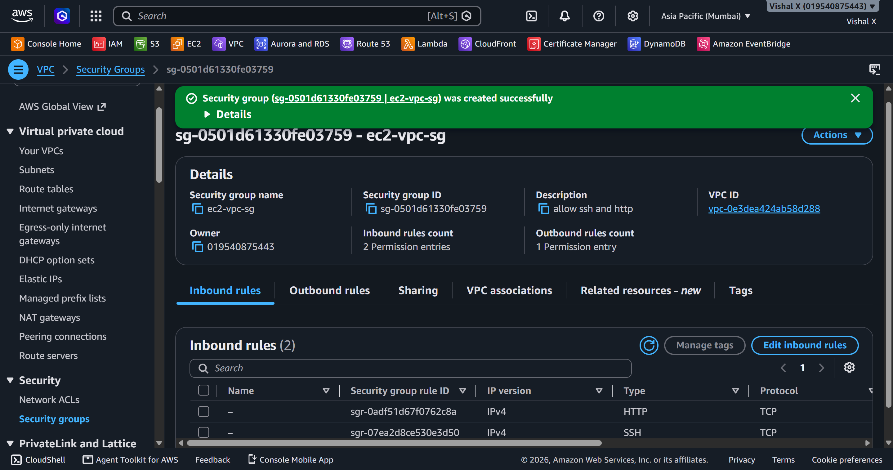
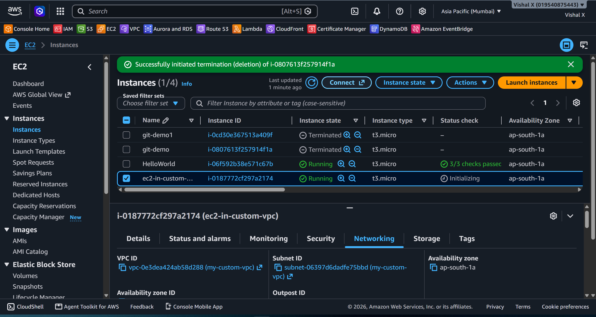
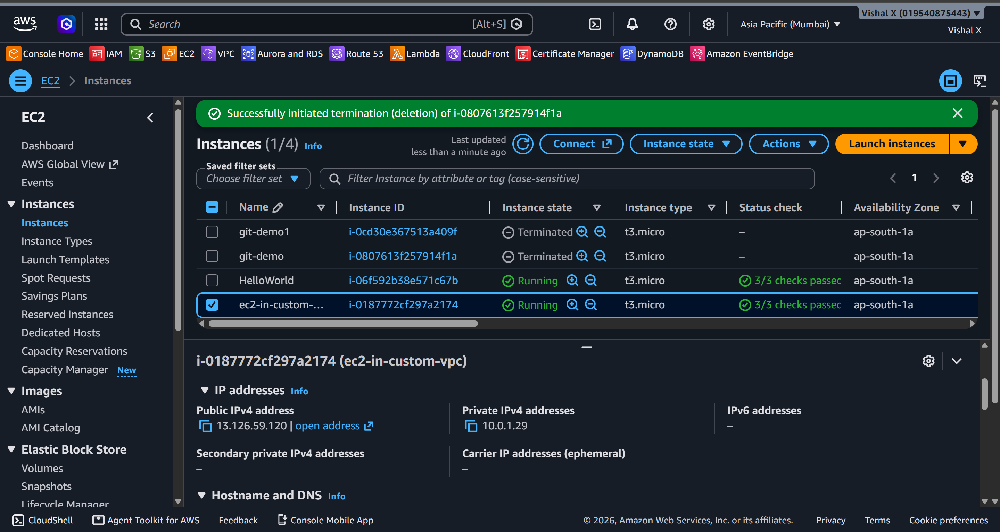
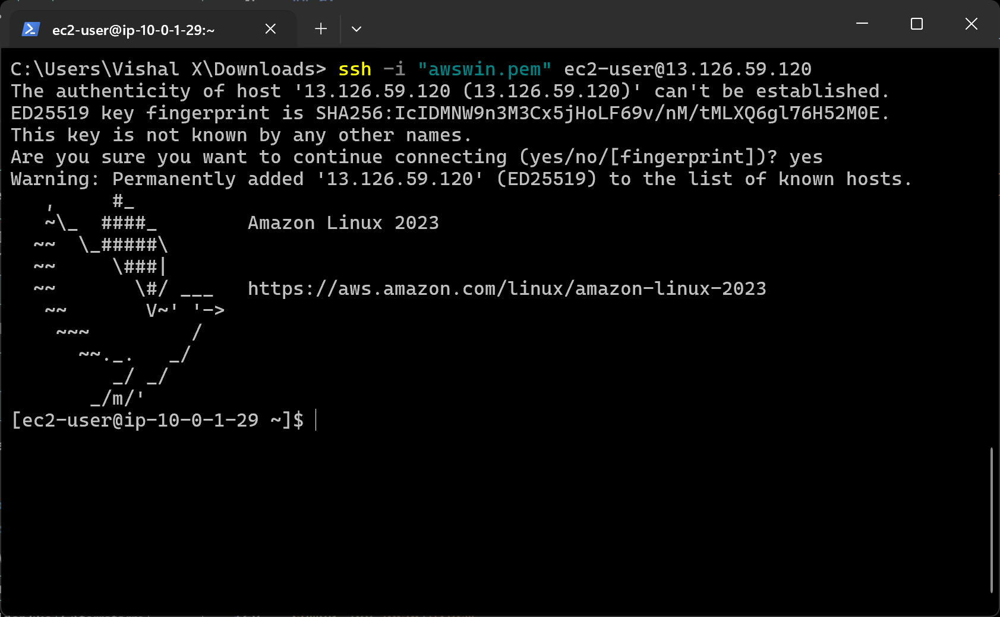
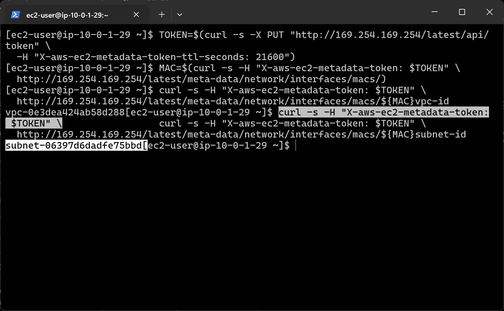
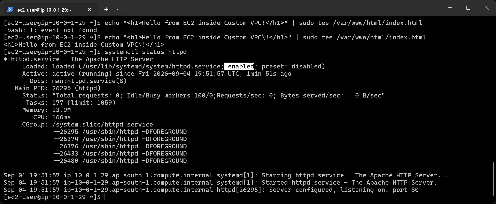
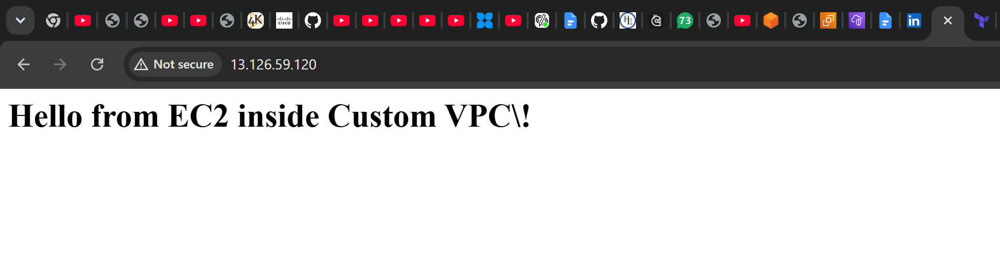
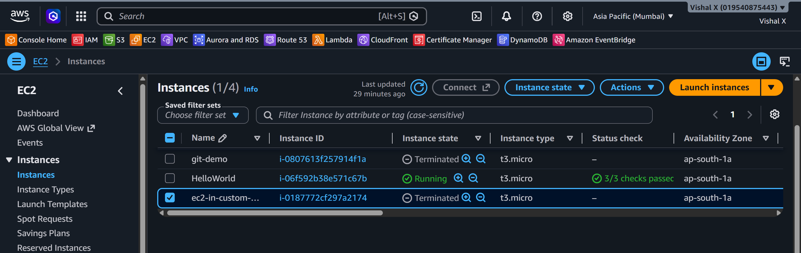

# EC2 Inside Custom VPC

Fifth project. Basically combining Project 1 and Project 4. I launched an EC2 instance inside the custom VPC I built earlier instead of using the default one. Wanted to make sure the networking I set up actually works end to end.

## What I built

An EC2 instance sitting inside my custom VPC — public subnet, internet gateway, security group, Apache running, page loading in the browser.



## Services used

| Service          | What I used it for                                        |
|------------------|-----------------------------------------------------------|
| VPC              | Custom network — not the default AWS one                  |
| Subnet           | Public subnet where the instance lives                    |
| Internet Gateway | Connects the VPC to the internet                          |
| Route Table      | Routes traffic from the subnet out to the internet        |
| EC2              | The virtual server                                        |
| Security Group   | Opens port 22 (SSH) and port 80 (HTTP)                    |

## Resources I created

| Resource         | Value             |
|------------------|-------------------|
| Region           | ap-south-1        |
| VPC              | my-custom-vpc     |
| VPC CIDR         | 10.0.0.0/16       |
| Public Subnet    | my-custom-subnet  |
| Subnet CIDR      | 10.0.1.0/24       |
| Internet Gateway | my-igw            |
| Route Table      | my-rt             |
| EC2 Instance     | ec2-in-custom-vpc |
| Instance Type    | t2.micro          |
| Key Pair         | awswin            |
| Security Group   | ec2-vpc-sg        |
| Public IP        | 13.126.59.120     |

---

## Steps

### 1. Reused the VPC from Project 4

Still had the VPC running so I used it directly. Had the public subnet, internet gateway attached, route table with `0.0.0.0/0 → IGW`, and auto-assign public IP enabled on the subnet.



---

### 2. Created a Security Group inside the custom VPC

Had to make sure the security group was created inside `my-custom-vpc`, not the default VPC.

- Name: `ec2-vpc-sg`
- VPC: `my-custom-vpc`
- Inbound rules:

| Type | Port | Source    | Why                   |
|------|------|-----------|-----------------------|
| SSH  | 22   | My IP     | Connect via SSH       |
| HTTP | 80   | 0.0.0.0/0 | Allow web traffic     |



---

### 3. Launched EC2 inside the custom VPC

- Name: `ec2-in-custom-vpc`
- AMI: Amazon Linux 2023
- Instance type: t2.micro
- Key pair: `awswin`
- VPC: `my-custom-vpc`
- Subnet: `my-custom-subnet`
- Auto-assign public IP: enabled
- Security group: `ec2-vpc-sg`



---

### 4. Verified instance is running

Waited for instance state `Running` and `2/2 checks passed`. Copied the public IP.



---

### 5. Connected via SSH

```powershell
ssh -i "awswin.pem" ec2-user@13.126.59.120
```



---

### 6. Verified the instance is inside the custom VPC

Amazon Linux 2023 uses IMDSv2 so a token is needed first before querying metadata.

```bash
TOKEN=$(curl -s -X PUT "http://169.254.169.254/latest/api/token" \
  -H "X-aws-ec2-metadata-token-ttl-seconds: 21600")

MAC=$(curl -s -H "X-aws-ec2-metadata-token: $TOKEN" \
  http://169.254.169.254/latest/meta-data/network/interfaces/macs/)

curl -s -H "X-aws-ec2-metadata-token: $TOKEN" \
  http://169.254.169.254/latest/meta-data/network/interfaces/macs/${MAC}vpc-id

curl -s -H "X-aws-ec2-metadata-token: $TOKEN" \
  http://169.254.169.254/latest/meta-data/network/interfaces/macs/${MAC}subnet-id
```

VPC ID and subnet ID matched what I created in Project 4.



---

### 7. Installed and started Apache

```bash
sudo yum update -y
sudo yum install httpd -y
sudo systemctl start httpd
sudo systemctl enable httpd
echo "<h1>Hello from EC2 inside Custom VPC!</h1>" | sudo tee /var/www/html/index.html
```



---

### 8. Tested from browser

Opened `http://13.126.59.120` — page loaded.



---

### 9. Cleaned up

Deleted in this order — order matters or AWS won't let you delete the VPC:

1. Terminated the EC2 instance
2. Deleted security group `ec2-vpc-sg`
3. Detached and deleted the Internet Gateway
4. Deleted the subnet
5. Deleted the route table
6. Deleted the VPC



---

## Screenshots

| # | File | Description |
|---|------|-------------|
| 01 | `screenshots/01-vpc-ready.png` | VPC and subnet |
| 02 | `screenshots/02-security-group.png` | Security group |
| 03 | `screenshots/03-launch-instance.png` | EC2 launch settings |
| 04 | `screenshots/04-instance-running.png` | Instance running |
| 05 | `screenshots/05-ssh-connection.png` | SSH connected |
| 06 | `screenshots/06-verify-vpc.png` | VPC ID confirmed |
| 07 | `screenshots/07-web-server-running.png` | Apache running |
| 08 | `screenshots/08-browser-test.png` | Browser test |
| 09 | `screenshots/09-cleanup.png` | Cleanup done |

## Commands

See [commands/commands.md](./commands/commands.md)

---

## Things that can go wrong

| Problem | What caused it | How I fixed it |
|---------|----------------|----------------|
| SSH times out | Security group created in wrong VPC | Recreated it inside my-custom-vpc |
| No public IP on instance | Auto-assign not enabled on subnet | Enabled auto-assign public IPv4 |
| Browser won't load | Port 80 not open | Added HTTP rule to security group |
| Instance launched in wrong VPC | Default VPC selected | Changed to my-custom-vpc in network settings |
| Can't delete VPC | EC2 still running | Terminated the instance first |
| curl metadata returns nothing | IMDSv2 required on AL2023 | Used token-based curl instead |

---

## Security notes

- Security group is inside the custom VPC, not the default one
- SSH is locked to my IP only
- `.pem` key is in `.gitignore` — never committed

---

## Cost

t2.micro is free tier. Terminated everything after testing. Internet gateway has a small hourly charge so deleted that too.

---

## What I learned

- How to launch EC2 inside a specific VPC and subnet
- That security groups are scoped to a VPC
- That Amazon Linux 2023 uses IMDSv2 — plain curl won't work for metadata
- How all the networking from Project 4 connects to an actual running server
- The correct order to delete VPC resources

---

## Final result


