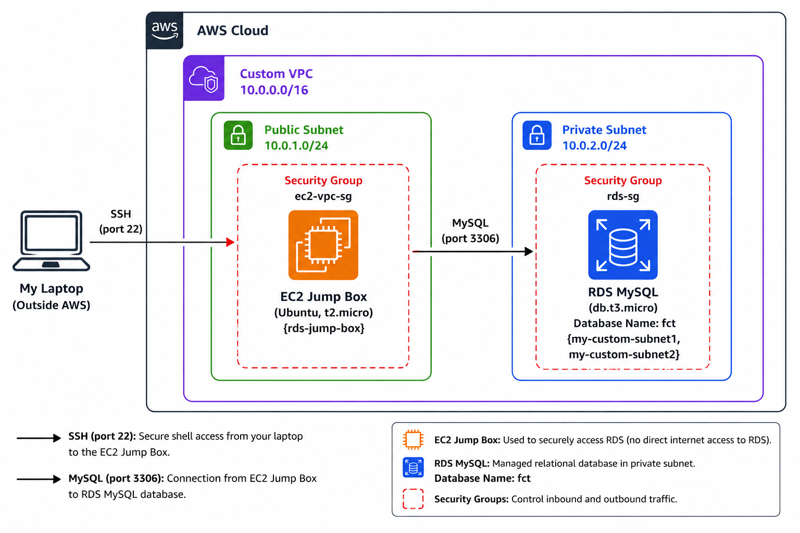
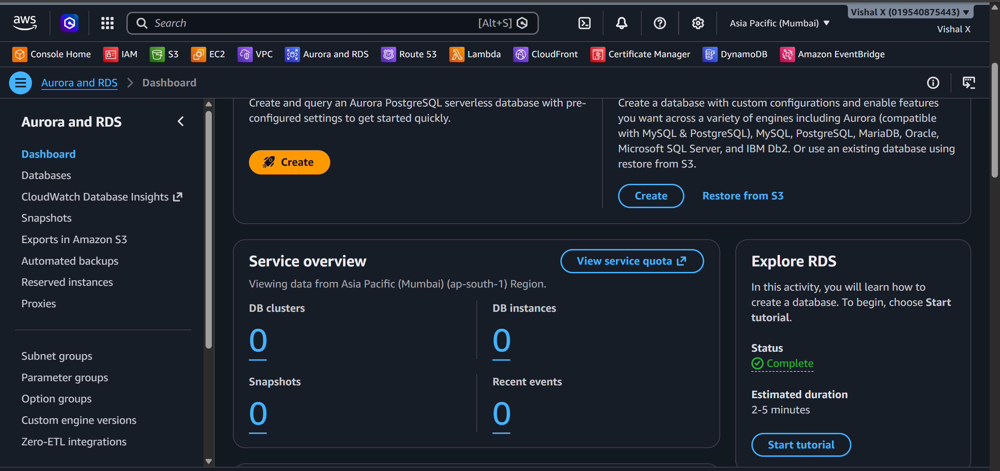
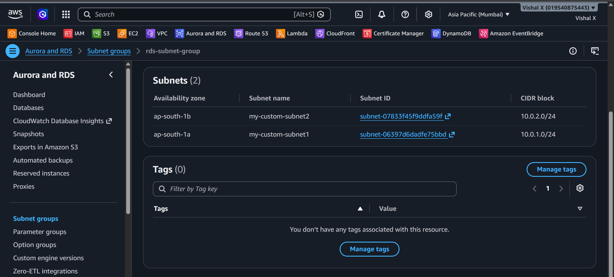
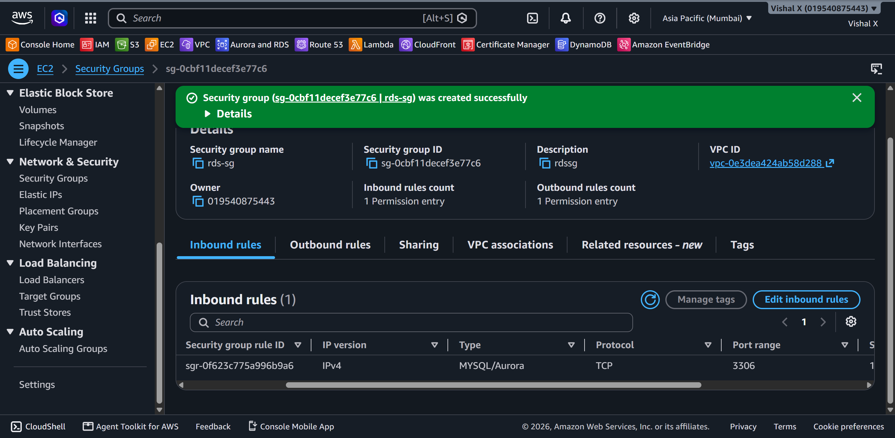
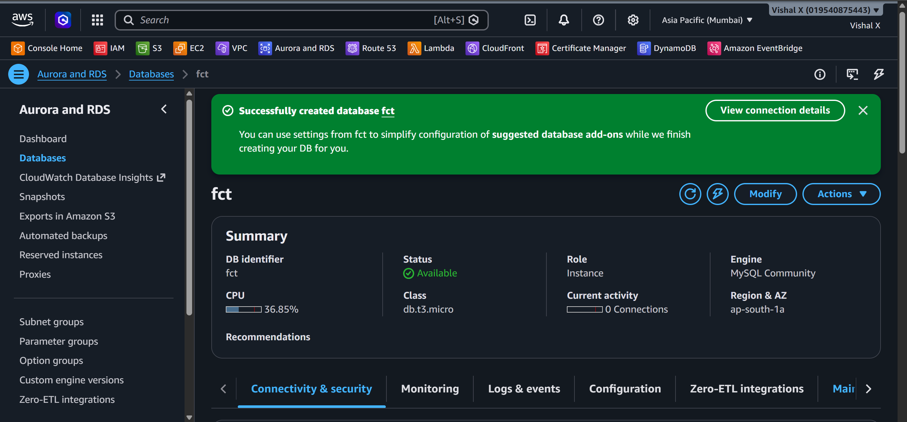
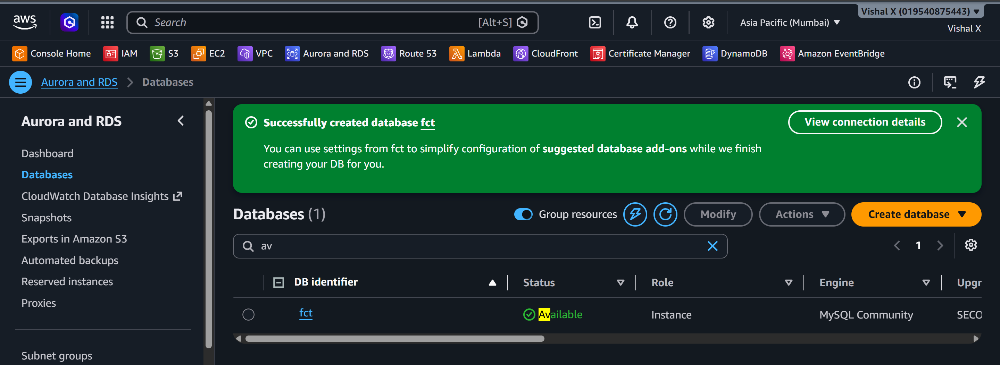
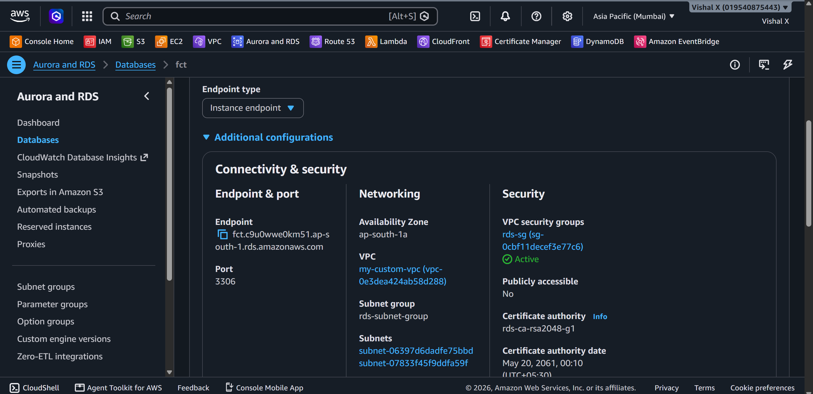
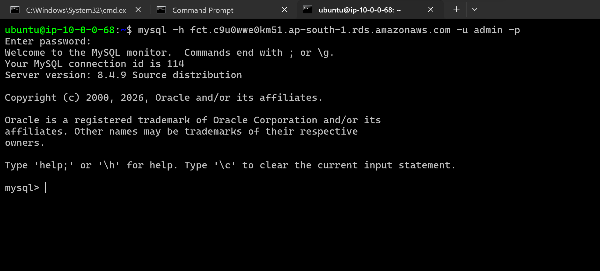
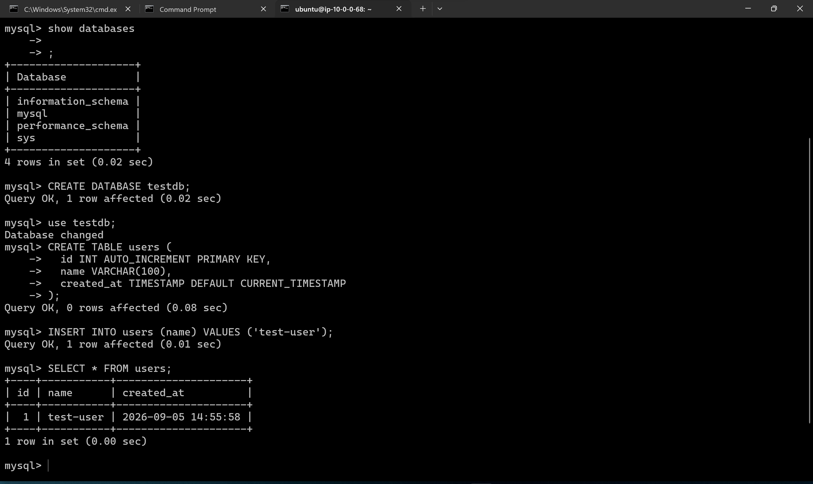
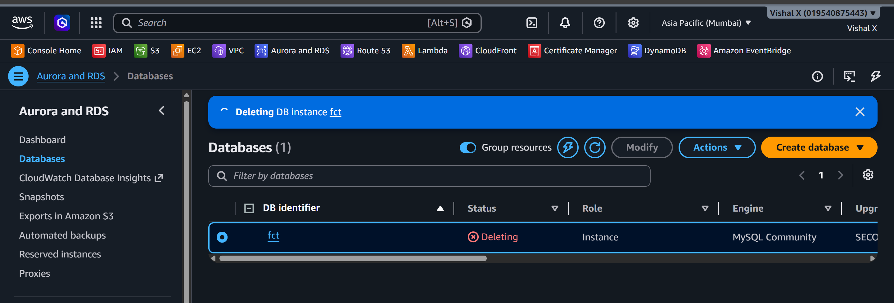

# RDS Database

Sixth project. First time setting up a managed database on AWS. Wanted to see how RDS works compared to just installing MySQL on an EC2 instance.

## What I built

A MySQL database on RDS inside a private subnet. No public access. Connected to it through an EC2 jump box in the same VPC.



## Why RDS over MySQL on EC2

Running MySQL on EC2 means handling backups, patches, and restarts yourself. RDS takes care of all that. Costs a bit more but saves a lot of time.

## Services used

| Service        | What I used it for                              |
|----------------|-------------------------------------------------|
| RDS            | Managed MySQL database                          |
| VPC            | Network where the database lives                |
| Subnets        | Private subnets across two availability zones   |
| Security Group | Controls which resources can reach the DB       |

## Resources I created

| Resource        | Value                    |
|-----------------|--------------------------|
| Region          | ap-south-1              |
| DB Engine       | MySQL 8.0                |
| Instance class  | db.t3.micro (Free Tier)  |
| DB name         | fct             |
| DB username     | admin         |
| DB endpoint     | fct.c9u0wwe0km51.ap-south-1.rds.amazonaws.com         |
| Security Group  | rds-sg                   |
| Subnet Group    | rds-subnet-group         |
| Jump Box EC2    | t2.micro (public subnet) |

---

## Steps

### 1. Opened RDS Console

Searched for RDS in the AWS Console and opened it.



---

### 2. Created a DB Subnet Group

RDS needs subnets in at least two AZs. Created a subnet group from my custom VPC subnets.

- Name: `rds-subnet-group`
- VPC: my custom VPC
- Added subnets from two different availability zones



---

### 3. Created a Security Group for RDS

Didn't want the database open to the internet. Created `rds-sg` and set the inbound rule to only allow the EC2 jump box.

| Type         | Port | Source     |
|--------------|------|------------|
| MySQL/Aurora | 3306 | ec2-vpc-sg |

Used `ec2-vpc-sg` as the source — only the EC2 instance can reach the DB, nothing else.



---

### 4. Created the RDS Instance

- Engine: MySQL 8.0
- Template: Free tier
- Instance identifier: `fct`
- Username: `admin`
- Instance class: db.t3.micro
- Storage: 20 GiB gp2
- VPC: my custom VPC
- Subnet group: `rds-subnet-group`
- Public access: No
- Security group: `rds-sg`



---

### 5. Waited for the database to become available

Took a few minutes to go from `Creating` to `Available`.



---

### 6. Copied the endpoint

Opened the database → Connectivity & security → copied the endpoint. That's the hostname used to connect.



---

### 7. Connected via EC2 jump box

RDS is in a private subnet so there's no way to connect directly from my laptop. Launched a small Ubuntu EC2 in the public subnet of the same VPC and SSH'd into it.

```powershell
ssh -i "awswin.pem" ubuntu@13.233.17.142
```

Installed the MySQL client on the jump box:

```bash
sudo apt update
sudo apt install mysql-client -y
```

Tested port 3306 connectivity first:

```bash
nc -zv fct.c9u0wwe0km51.ap-south-1.rds.amazonaws.com 3306
```

Then tried connecting to RDS:

```bash
mysql -h fct.c9u0wwe0km51.ap-south-1.rds.amazonaws.com -u admin -p
```

Got this error on the first attempt:

```
ERROR 2026 (HY000): SSL connection error: SSL_CTX_set_default_verify_paths failed
```

Fixed it by installing CA certificates:

```bash
sudo apt install ca-certificates -y
```

Retried and it connected.



---

### 8. Ran test queries

```sql
SHOW DATABASES;

CREATE DATABASE testdb;
USE testdb;

CREATE TABLE users (
  id INT AUTO_INCREMENT PRIMARY KEY,
  name VARCHAR(100),
  created_at TIMESTAMP DEFAULT CURRENT_TIMESTAMP
);

INSERT INTO users (name) VALUES ('test-user');
SELECT * FROM users;
```



---

### 9. Cleaned up

Deleted the RDS instance from the console — unchecked final snapshot since it was just a test. Then deleted the subnet group and security group.



---

## Screenshots

| # | File | Description |
|---|------|-------------|
| 01 | `screenshots/01-rds-console.png` | RDS Console |
| 02 | `screenshots/02-subnet-group.png` | DB subnet group |
| 03 | `screenshots/03-security-group.png` | RDS security group |
| 04 | `screenshots/04-create-database.png` | Database creation form |
| 05 | `screenshots/05-db-available.png` | Database available |
| 06 | `screenshots/06-db-endpoint.png` | Database endpoint |
| 07 | `screenshots/07-db-connection.png` | Connected via MySQL client |
| 08 | `screenshots/08-test-queries.png` | Test queries result |
| 09 | `screenshots/09-cleanup.png` | Cleanup done |

## Commands

See [commands/commands.md](./commands/commands.md)

---

## Things that can go wrong

| Problem | What caused it | How I fixed it |
|---------|----------------|----------------|
| Can't connect to DB | Security group blocking port 3306 | Added ec2-vpc-sg as source in rds-sg |
| Can't connect to DB | Tried connecting directly from laptop | RDS is private — SSH into EC2 first |
| Connection timeout | Wrong endpoint | Copied the correct endpoint from RDS console |
| DB creation fails | No subnets in multiple AZs | Added subnets from two AZs to subnet group |
| SSL connection error | CA certificates missing on Ubuntu | `sudo apt install ca-certificates -y` then retry |
| MySQL client not found | Not installed on jump box | `sudo apt install mysql-client -y` |

---

## Security notes

- Public access is off — RDS is not reachable from the internet
- Only the EC2 jump box (`ec2-vpc-sg`) can connect on port 3306
- DB password is not documented or committed anywhere
- For production: use IAM database authentication instead of username/password

---

## Cost

db.t3.micro is free tier eligible — 750 hours/month for 12 months. 20 GB storage is also free. RDS charges by the hour even when idle so always delete after testing.

---

## What I learned

- How RDS differs from running MySQL on EC2
- What a DB subnet group is and why it needs multiple AZs
- Why public access should be off for databases
- How security groups work as the access control layer
- That Ubuntu needs `ca-certificates` installed for MySQL SSL to work
- How to use an EC2 jump box to reach a private RDS instance
