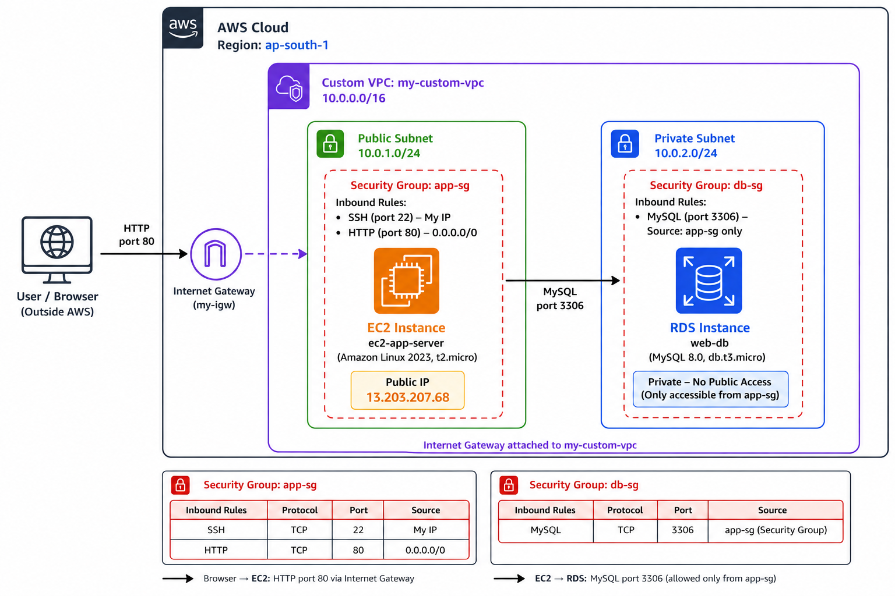
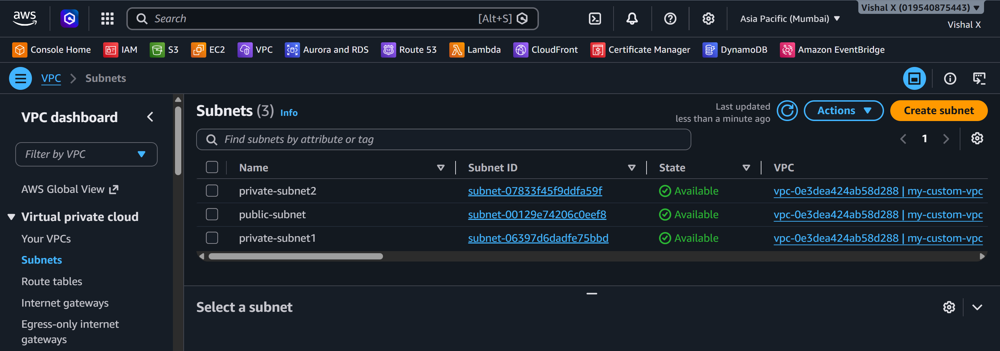
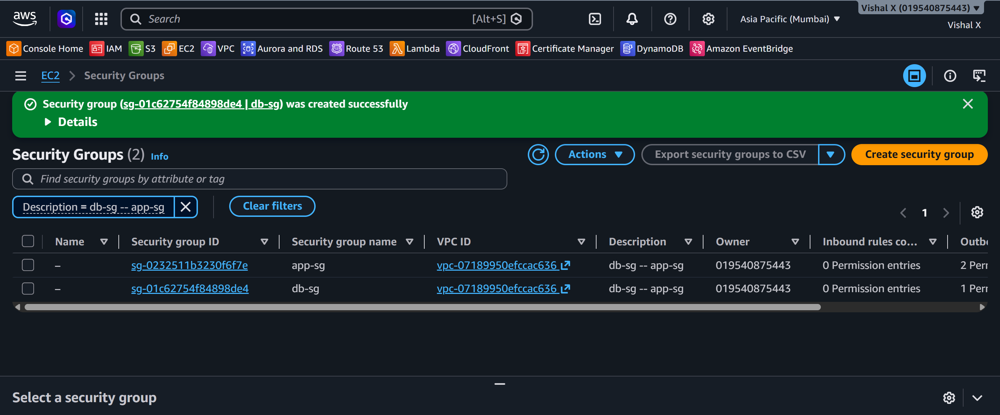
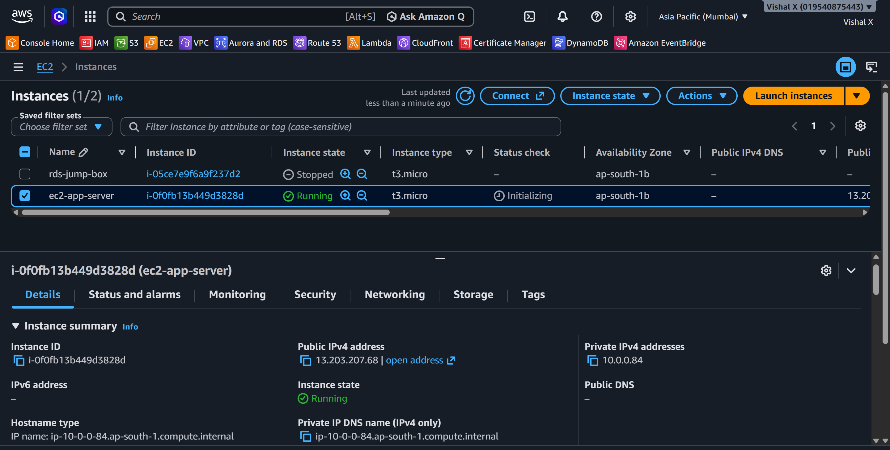
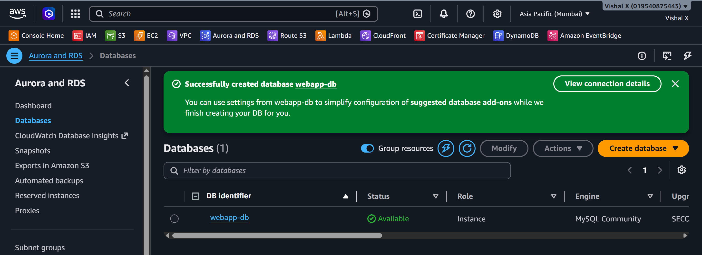
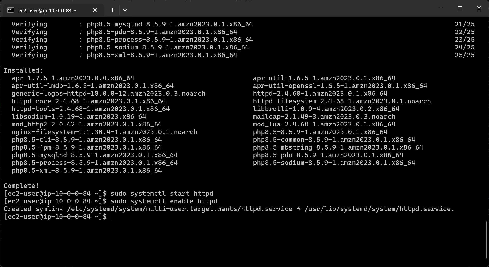
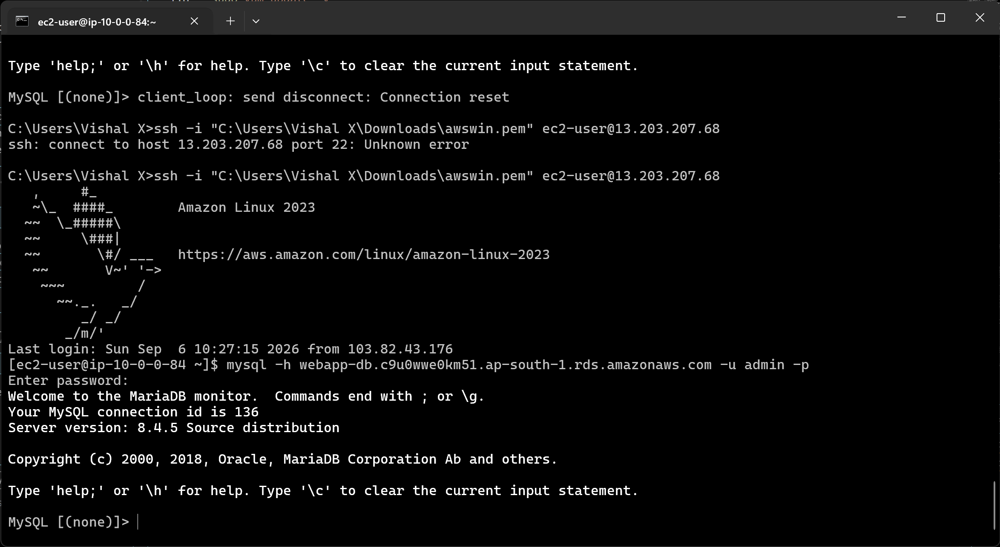
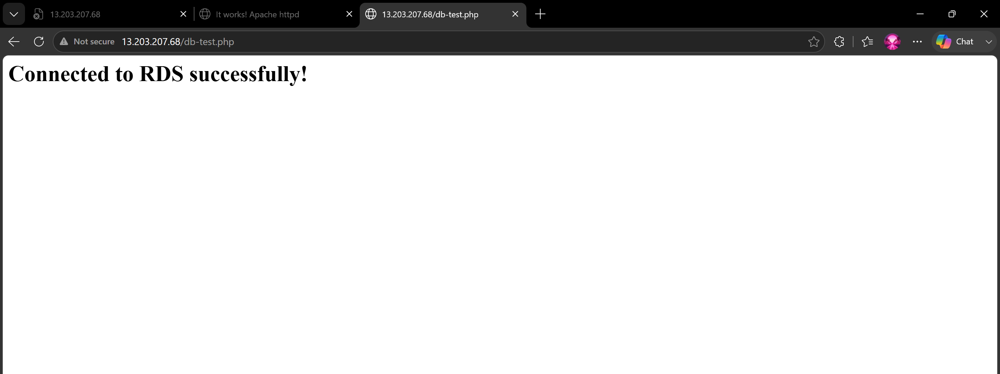
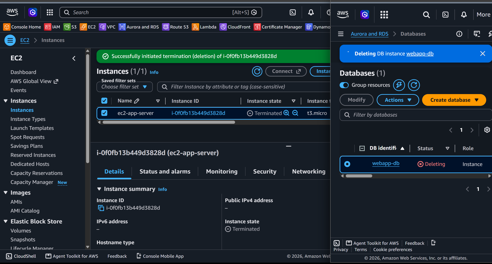

# Two-Tier Web Application

Seventh project. This one combines EC2 and RDS together. The EC2 instance is the application server (web tier) and RDS is the database (data tier). The two talk to each other privately inside the VPC — the database is never exposed to the internet.

## What I built

A two-tier architecture with an EC2 web server in a public subnet and an RDS database in a private subnet. The web server connects to the database and shows the result in the browser.



## Why two tiers

Separating the web server and database is a fundamental pattern. The web server handles HTTP requests from users. The database stores data. They communicate privately. If someone attacks the web server, the database is still protected because it has no public access.

## Services used

| Service        | What I used it for                                  |
|----------------|-----------------------------------------------------|
| EC2            | Web/application server in the public subnet         |
| RDS            | MySQL database in the private subnet                |
| VPC            | Network that connects both tiers                    |
| Security Groups | Controls traffic between the tiers and from internet |

## Resources I created

| Resource          | Value                    |
|-------------------|--------------------------|
| Region            | ap-south-1              |
| VPC               | my-custom-vpc            |
| EC2 instance      | ec2-app-server           |
| EC2 public IP     | 13.203.207.68           |
| RDS instance      | web-db             |
| DB endpoint       | webapp-db.c9u0wwe0km51.ap-south-1.rds.amazonaws.com         |
| App security group | app-sg                  |
| DB security group | db-sg                    |

---

## Steps

### 1. Prepared the VPC and subnets

Used the custom VPC from Project 4:
- Public subnet for EC2
- Private subnets for RDS (needs two AZs)



---

### 2. Created both security groups

Needed two security groups — one for the app server, one for the database. Created `app-sg` first because `db-sg` references it as the source.

**app-sg** (for EC2):

| Type | Port | Source    |
|------|------|-----------|
| SSH  | 22   | My IP     |
| HTTP | 80   | 0.0.0.0/0 |

**db-sg** (for RDS) — used `app-sg` as the source so only the EC2 instance can reach the database:

| Type         | Port | Source |
|--------------|------|--------|
| MySQL/Aurora | 3306 | app-sg |



---

### 4. Launched the EC2 app server

1. EC2 Console → **Launch Instance**
2. Name: `ec2-app-server`
3. AMI: Amazon Linux 2023
4. Instance type: t2.micro
5. Key pair: awswin
6. Network settings:
   - VPC: my custom VPC
   - Subnet: public subnet
   - Auto-assign public IP: Enable
   - Security group: `app-sg`
7. Clicked **Launch instance**



---

### 5. Created the RDS database

1. RDS Console → **Create database**
2. Engine: MySQL 8.0
3. Template: Free tier
4. DB name: webapp-db
5. Username: admin
6. VPC: my custom VPC
7. Subnet group: rds-subnet-group (from Project 6, or create a new one)
8. Public access: **No**
9. Security group: `db-sg`
10. Clicked **Create database**



---

### 6. SSH'd into EC2 and installed Apache and PHP

```powershell
ssh -i "awswin" ec2-user@13.203.207.68
```

```bash
sudo yum update -y
sudo yum install httpd php php-mysqlnd -y
sudo systemctl start httpd
sudo systemctl enable httpd
```



---

### 7. Tested the database connection from EC2

Amazon Linux 2023 doesn't have the `mysql` package — installed `mariadb105` instead:

```bash
sudo dnf install mariadb105 -y
```

Then connected to RDS:

```bash
mysql -h webapp-db.c9u0wwe0km51.ap-south-1.rds.amazonaws.com -u admin -p
```



---

### 8. Created a PHP test page

```bash
sudo tee /var/www/html/db-test.php << 'EOF'
<?php
$conn = new mysqli('webapp-db.c9u0wwe0km51.ap-south-1.rds.amazonaws.com', 'admin', 'MY_DB_PASSWORD', 'webapp-db');
if ($conn->connect_error) {
    die("Connection failed: " . $conn->connect_error);
}
echo "<h1>Connected to RDS successfully!</h1>";
$conn->close();
?>
EOF
```

> ⚠️ Replace placeholders with real values when testing. Never commit real credentials to GitHub.

---

### 9. Tested from browser

Opened `http://13.203.207.68/db-test.php` in the browser.



---

### 10. Cleaned up

Deleted in this order:
1. Terminate EC2 instance
2. Delete RDS instance 
3. Delete security groups `app-sg` and `db-sg`
4. Delete DB subnet group if created fresh



---

## Screenshots

| # | File | Description |
|---|------|-------------|
| 01 | `screenshots/01-vpc-subnets.png` | VPC and subnets |
| 02 | `screenshots/02-security-groups.png` | Both security groups |
| 03 | `screenshots/04-ec2-running.png` | EC2 running |
| 04 | `screenshots/05-rds-available.png` | RDS available |
| 05 | `screenshots/06-apache-php-installed.png` | Apache and PHP installed |
| 06 | `screenshots/08-db-connection-from-ec2.png` | DB connection from EC2 |
| 07 | `screenshots/09-browser-test.png` | Browser test |
| 08 | `screenshots/10-cleanup.png` | Cleanup done |

## Commands

See [commands/commands.md](./commands/commands.md)

---

## Things that can go wrong

| Problem | What caused it | How I fixed it |
|---------|----------------|----------------|
| Can't connect to RDS from EC2 | db-sg not referencing app-sg | Updated db-sg inbound rule to use app-sg as source |
| Browser shows blank page | PHP not installed | Ran `sudo yum install php php-mysqlnd -y` |
| Connection refused on port 3306 | Wrong security group on RDS | Attached db-sg to the RDS instance |
| EC2 can't reach RDS | Different VPCs | Made sure both are in the same VPC |
| PHP page shows connection error | Wrong DB endpoint or credentials | Double-checked endpoint from RDS console |

---

## Security notes

- The database has no public access — it's only reachable from inside the VPC
- The db-sg uses a security group reference, not an IP — this is the right way to do it
- Never hardcode database credentials in PHP files that get committed to GitHub
- For production: use AWS Secrets Manager to store and retrieve DB credentials

---

## Cost

Both t2.micro EC2 and db.t3.micro RDS are free tier eligible. Terminate both after testing. RDS charges by the hour even when idle so don't leave it running.

---

## What I learned

- What a two-tier architecture is and why it's used
- How to use security group references instead of IP addresses
- How EC2 and RDS communicate inside a VPC
- How to install PHP and connect it to MySQL
- Why the database should never have public access
- That the order of creating security groups matters when using references

---

## Final result


