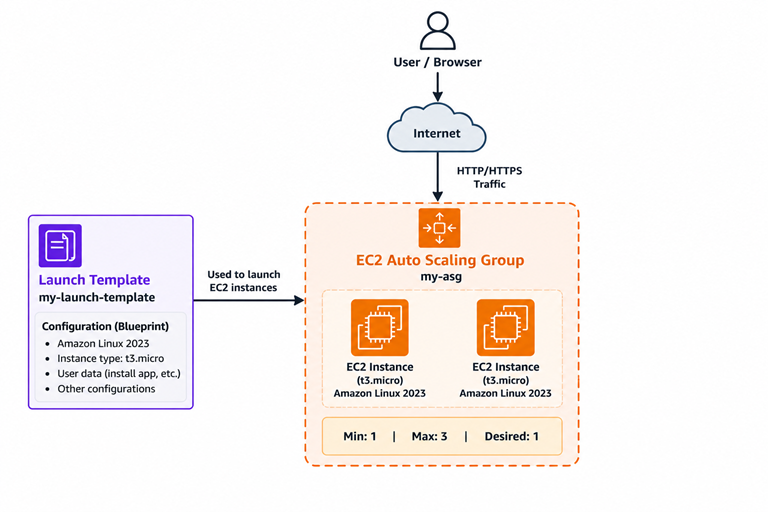
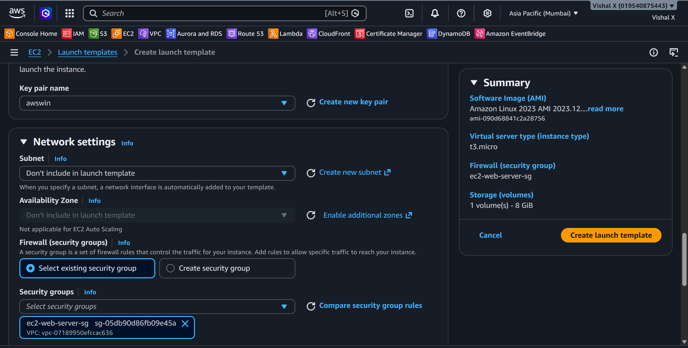
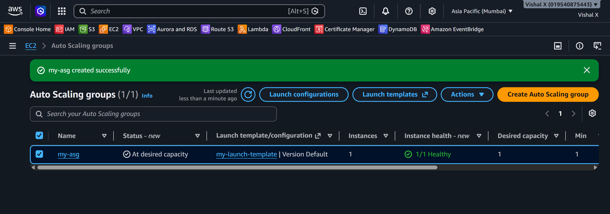
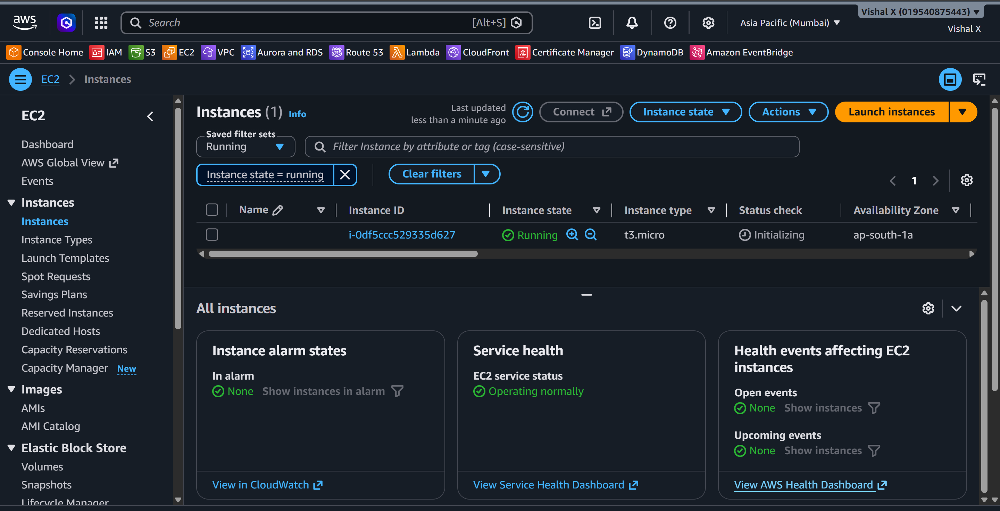
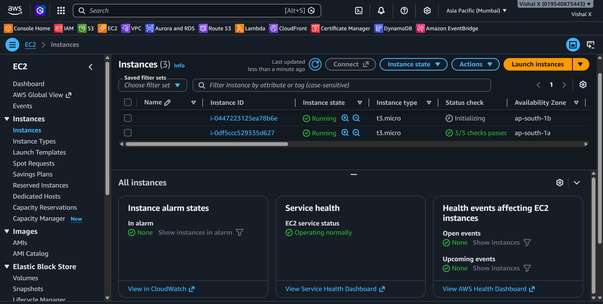
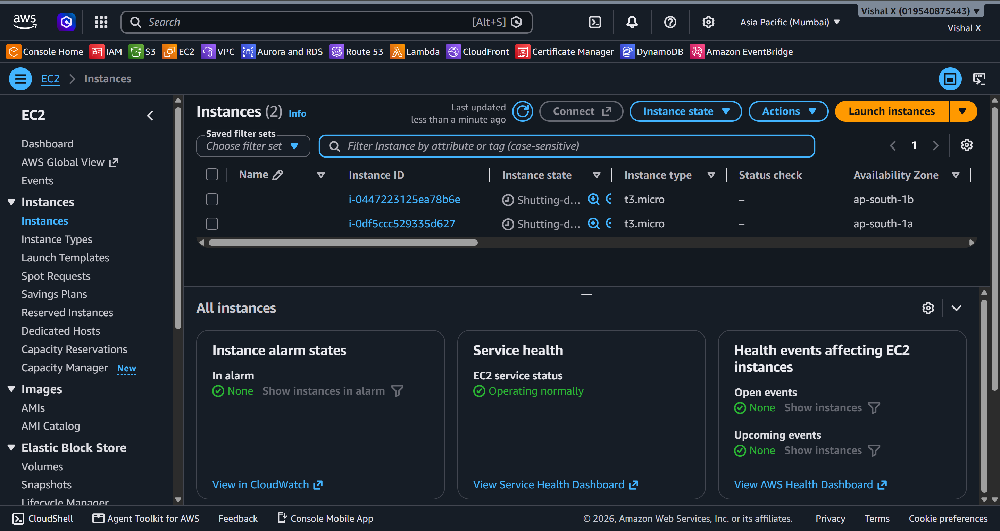

# Auto Scaling Group

Eighth project. Wanted to see how AWS handles automatic scaling — spinning up more EC2 instances when load increases and terminating them when it drops. This is one of those things that makes cloud different from running your own servers.

## What I built

An Auto Scaling Group with a Launch Template that automatically manages EC2 instances based on desired capacity and scaling policies.

## Why Auto Scaling

With a single EC2 instance, if traffic spikes the server gets overwhelmed. ASG solves that by automatically adding instances when needed and removing them when traffic drops. You only pay for what you use.

## Services used

| Service            | What I used it for                             |
|--------------------|------------------------------------------------|
| EC2                | The instances that get launched automatically  |
| Launch Template    | Blueprint for how each EC2 instance is created |
| Auto Scaling Group | Manages the number of running instances        |
|         |               |

## Resources I created

| Resource        | Value              |
|-----------------|--------------------|
| Region          | ap-south-1        |
| Launch Template | my-launch-template |
| AMI             | Amazon Linux 2023  |
| Instance Type   | t2.micro           |
| ASG Name        | my-asg             |
| Min instances   | 1                  |
| Max instances   | 3                  |
| Desired         | 1                  |

---

## Steps

### 1. Created a Launch Template

EC2 → Launch Templates → Create launch template.

- Launch template name: `my-launch-template`
- AMI: Amazon Linux 2023 (search in Quick Start)
- Instance type: `t3.micro`
- Key pair: `awswin`
- Network settings → Security groups: select an existing security group that allows SSH (port 22)
- Left everything else as default → Create launch template

---

### 2. Created the Auto Scaling Group

EC2 → Auto Scaling Groups → Create Auto Scaling group.

**Step 1 — Choose launch template:**
- Name: `my-asg`
- Launch template: `my-launch-template` → Next

**Step 2 — Choose instance launch options:**
- VPC: `my-custom-vpc`
- Availability Zones and subnets: select both public subnets (one per AZ) → Next

**Step 3 — Configure advanced options:**
- No load balancer for now → Next

**Step 4 — Configure group size and scaling:**
- Desired capacity: `1`
- Min desired capacity: `1`
- Max desired capacity: `3`
- No scaling policies → Next

**Steps 5–7:** Skip notifications and tags → Review → Create Auto Scaling group

---

### 3. Verified instance launched

After creating the ASG, went to EC2 → Instances. One instance was already launching — ASG spun it up automatically to meet the desired count of 1. Waited for it to reach running state.

---

### 4. Tested scaling

EC2 → Auto Scaling Groups → select `my-asg` → Edit.

- Changed Desired capacity from `1` to `2` → Update

Went back to EC2 → Instances — a second instance started launching within seconds. Both ended up running in different AZs.

---

### 5. Cleaned up

EC2 → Auto Scaling Groups → select `my-asg` → Edit → set Desired, Min, and Max all to `0` → Update. Waited for both instances to terminate.

Then:
- Actions → Delete the ASG
- EC2 → Launch Templates → select `my-launch-template` → Actions → Delete

---

## Screenshots

| # | File | Description |
|---|------|-------------|
| 01 | `screenshots/01-launch-template.png` | Launch template created |
| 02 | `screenshots/02-asg-created.png` | ASG created |
| 03 | `screenshots/03-instance-launched.png` | Instance auto-launched |
| 04 | `screenshots/04-scaling-test.png` | Scaling test |
| 05 | `screenshots/05-cleanup.png` | Cleanup done |

## Commands

See [commands/commands.md](./commands/commands.md)

---

## Things that can go wrong

| Problem | What caused it | How I fixed it |
|---------|----------------|----------------|
| ASG not launching instances | No subnets selected | Added subnets in ASG network settings |
| Instance launches in wrong VPC | Wrong subnet selected | Selected subnets from my-custom-vpc |
| Can't delete ASG | Instances still running | Set desired to 0 first, waited for termination |

---

## Security notes

- Launch template uses existing security group — no new ports opened
- Instances launched by ASG follow the same security rules as manually launched ones

---

## Cost

t2.micro is free tier. ASG itself has no cost — you pay for the EC2 instances it launches. Always set desired to 0 or delete the ASG after testing.

---

## What I learned

- What a Launch Template is and how it differs from a Launch Configuration
- How ASG uses min/max/desired to manage instance count
- That ASG can span multiple AZs for high availability
- How to manually trigger scaling to test it
