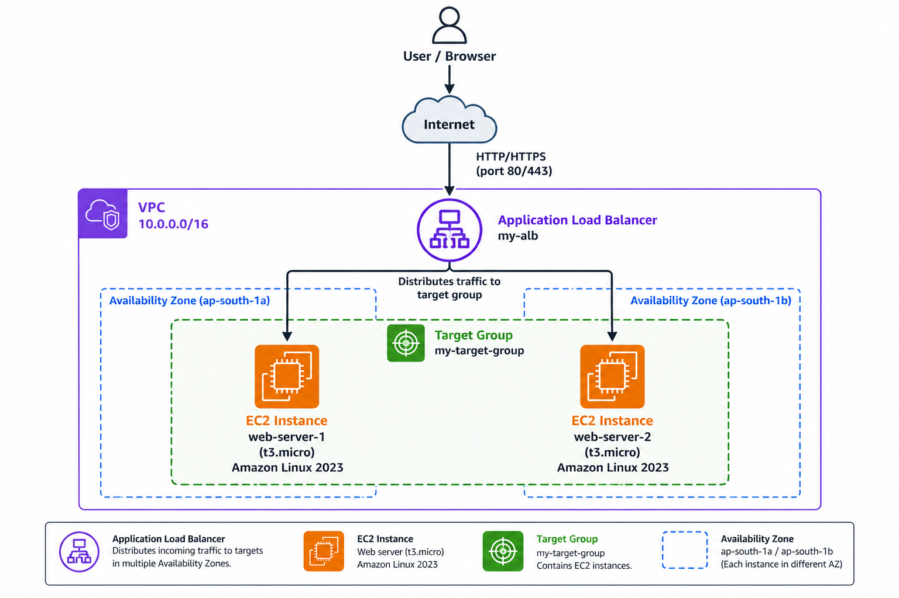
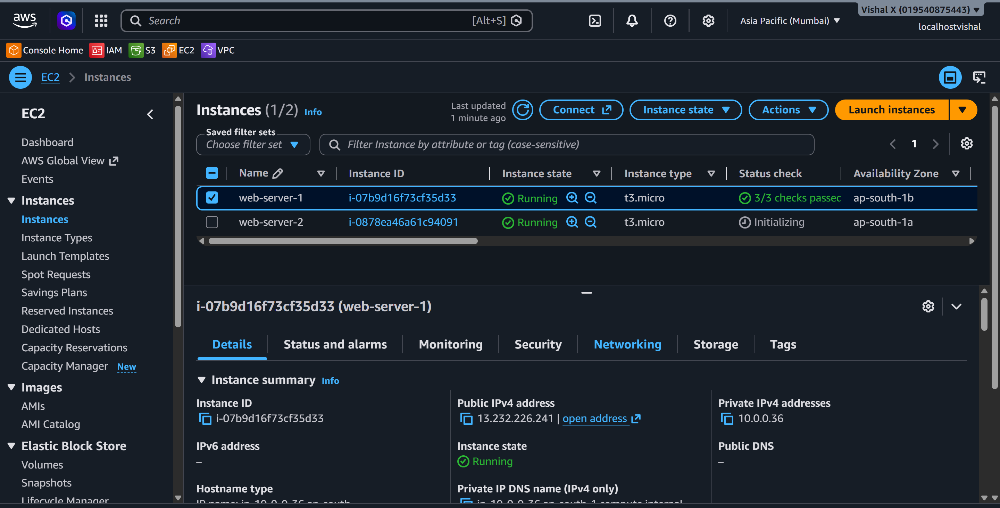
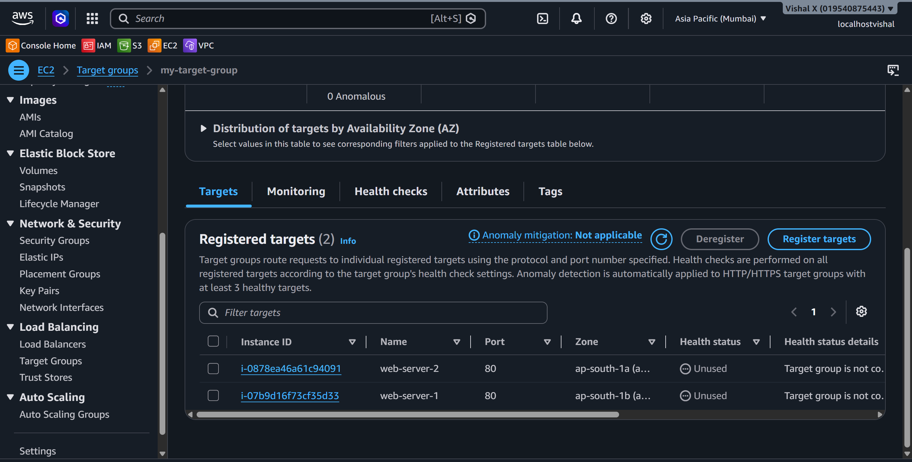
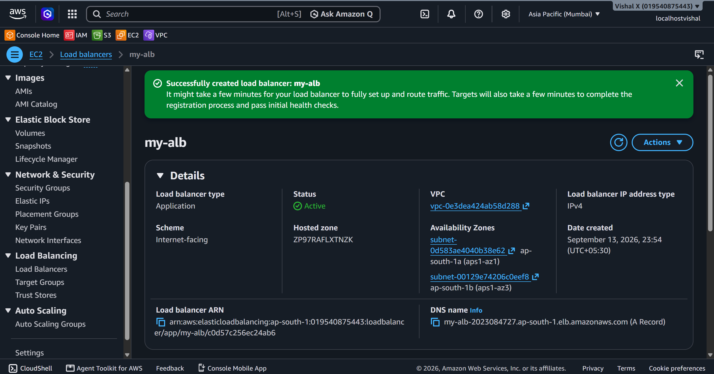
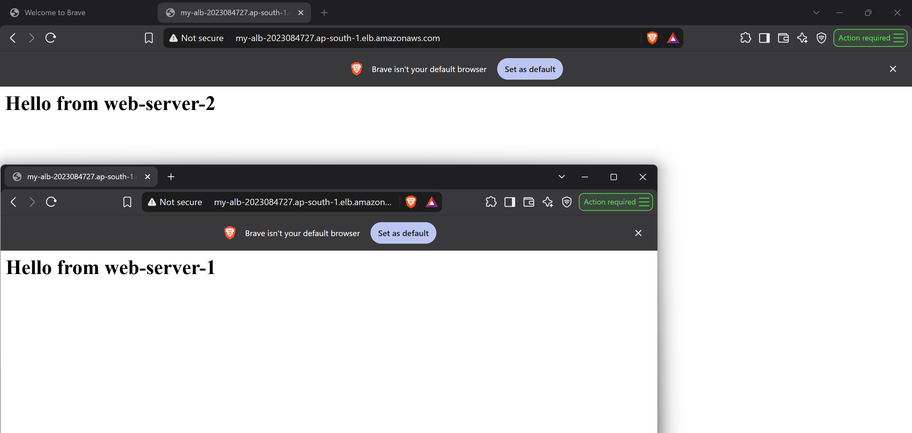
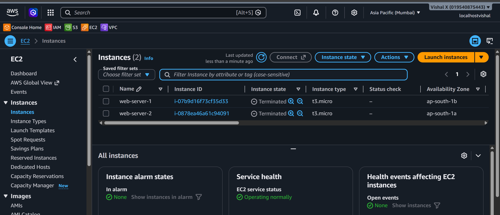

# Load Balancer

Ninth project. Set up an Application Load Balancer to distribute traffic across multiple EC2 instances. This is how real applications handle traffic without a single point of failure.

## What I built

An ALB sitting in front of two EC2 instances. Traffic hits the load balancer and gets distributed across both instances. If one goes down, traffic automatically goes to the other.



## Why a Load Balancer

A single EC2 instance is a single point of failure. ALB distributes incoming traffic across multiple instances and does health checks — if an instance fails, ALB stops sending traffic to it automatically.

## Services used

| Service          | What I used it for                              |
|------------------|-------------------------------------------------|
| EC2              | Two web server instances behind the ALB         |
| ALB              | Distributes traffic across EC2 instances        |
| Target Group     | Group of EC2 instances the ALB routes to        |
| Security Groups  | Controls traffic to ALB and EC2 instances       |

## Resources I created

| Resource       | Value           |
|----------------|-----------------|
| Region         | ap-south-1     |
| ALB Name       | my-alb          |
| Target Group   | my-target-group |
| EC2 Instance 1 | web-server-1    |
| EC2 Instance 2 | web-server-2    |
| ALB DNS        | my-alb-2023084727.ap-south-1.elb.amazonaws.com    |

---

## Steps

### 1. Launched two EC2 instances

EC2 → Instances → Launch instance. Did this twice.

- Name: `web-server-1` (second one: `web-server-2`)
- AMI: Amazon Linux 2023
- Instance type: `t3.micro`
- Key pair: `awswin`
- Network: `my-custom-vpc` — pick a different public subnet for each instance (one per AZ)
- Security group: allow SSH (22) from My IP and HTTP (80) from anywhere
- User data — paste this so Apache starts automatically:

```bash
#!/bin/bash
yum install -y httpd
echo "<h1>Hello from web-server-1</h1>" > /var/www/html/index.html
systemctl start httpd
systemctl enable httpd
```

I changed the message to `web-server-2` for the second instance so I could tell them apart.



---

### 2. Created a Target Group

EC2 → Target Groups → Create target group.

- Target type: Instances
- Name: `my-target-group`
- Protocol: HTTP, Port: `80`
- VPC: `my-custom-vpc`
- Health check protocol: HTTP, Path: `/`
- Click Next → select both EC2 instances → Include as pending below → Create target group



---

### 3. Created the Application Load Balancer

EC2 → Load Balancers → Create load balancer → Application Load Balancer.

- Name: `my-alb`
- Scheme: Internet-facing
- IP address type: IPv4
- VPC: `my-custom-vpc`
- Mappings: select both public subnets (one per AZ)
- Security groups: create new or select one that allows HTTP port 80 from `0.0.0.0/0`
- Listeners: HTTP port 80 → Forward to `my-target-group`
- Create load balancer

Waited for state to change from provisioning to **Active**.



---

### 4. Tested the load balancer

Copied the DNS name from the ALB detail page and opened it in the browser. Refreshed several times — the response alternated between `web-server-1` and `web-server-2`.



---

### 5. Cleaned up

- EC2 → Load Balancers → select `my-alb` → Actions → Delete
- EC2 → Target Groups → select `my-target-group` → Actions → Delete
- EC2 → Instances → select both → Instance state → Terminate



---

## Screenshots

| # | File | Description |
|---|------|-------------|
| 01 | `screenshots/01-ec2-instances.png` | Both EC2 instances running |
| 02 | `screenshots/02-target-group.png` | Target group with instances registered |
| 03 | `screenshots/03-alb-created.png` | ALB created and active |
| 04 | `screenshots/04-alb-test.png` | Browser test via ALB DNS |
| 05 | `screenshots/05-cleanup.png` | Cleanup done |

## Commands

See [commands/commands.md](./commands/commands.md)

---

## Things that can go wrong

| Problem | What caused it | How I fixed it |
|---------|----------------|----------------|
| ALB returns 502 | EC2 instances not healthy | Checked security group allows port 80 from ALB |
| Health check failing | Wrong health check path | Changed path to `/` |
| ALB not reachable | ALB security group missing port 80 | Added HTTP inbound rule to ALB SG |
| Only one instance responding | Other instance unhealthy | Checked Apache was running on both |

---

## Security notes

- EC2 security group only allows port 80 from the ALB security group — not from the internet directly
- ALB is the only entry point for HTTP traffic

---

## Cost

ALB charges by the hour plus LCU usage. Terminate after testing. Two t2.micro instances are free tier eligible.

---

## What I learned

- What an Application Load Balancer is and how it works
- What a Target Group is and how health checks work
- How to distribute traffic across multiple EC2 instances
- That ALB needs subnets in at least two AZs
