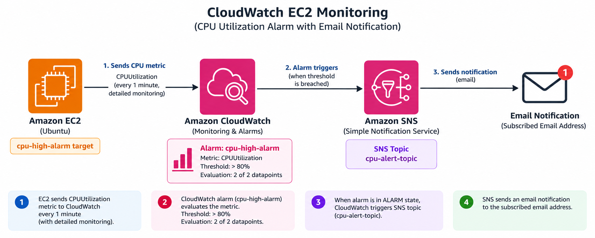
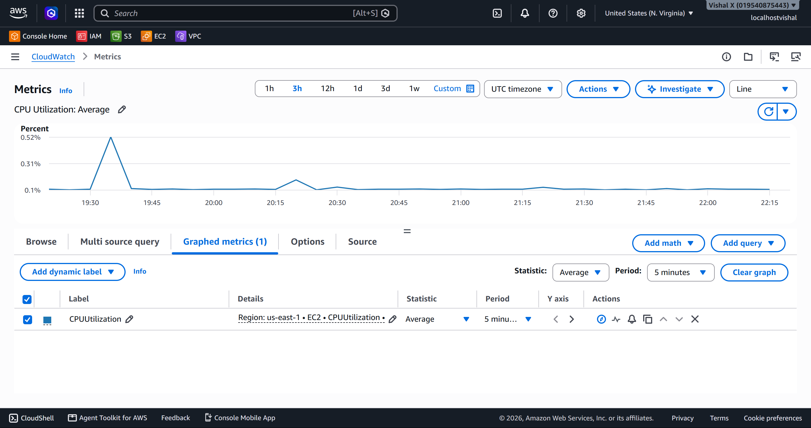
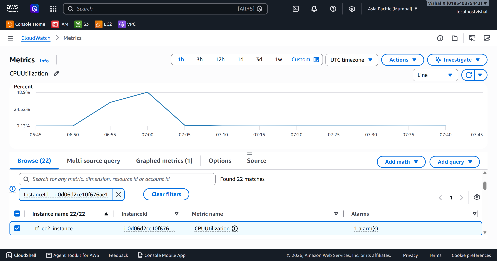
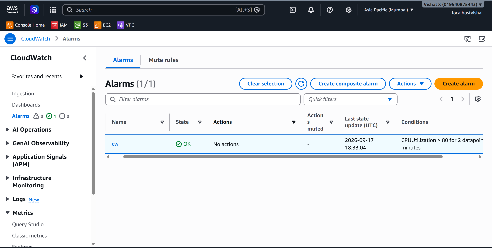
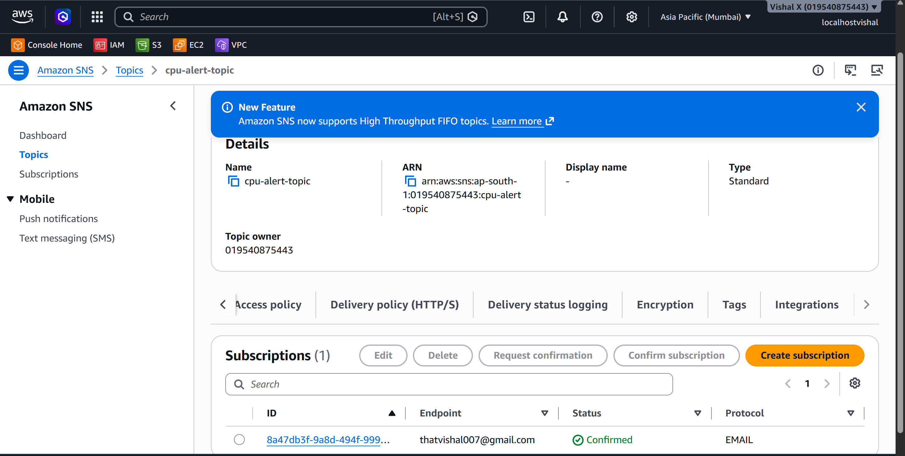
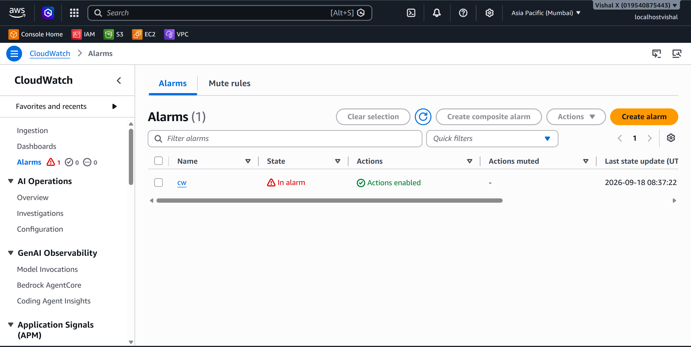
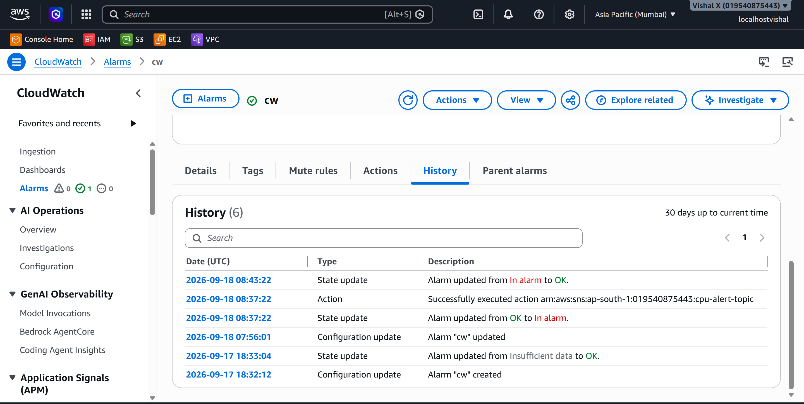

# CloudWatch EC2 Monitoring

Tenth project. Set up real monitoring on an EC2 instance using CloudWatch — created an alarm, wired it to SNS for email notifications, then generated actual CPU load to trigger it. This is how you know something is wrong before users start complaining.

## What I built

A CloudWatch alarm watching CPU utilization on an EC2 instance. When CPU goes above 80% for two consecutive minutes, the alarm fires and sends an email via SNS. I also generated load using the `stress` tool to actually trigger it and see the whole thing work end to end.



## Why CloudWatch

Without monitoring, a server can be maxed out and I'd have no idea until something breaks. CloudWatch collects EC2 metrics automatically — no agent needed for basic metrics. Setting an alarm means the system tells me when something needs attention instead of me having to watch dashboards.

## Services used

| Service     | What I used it for                                          |
|-------------|-------------------------------------------------------------|
| EC2         | The instance being monitored                                |
| CloudWatch  | Collects metrics, evaluates the alarm condition             |
| SNS         | Sends the email notification when the alarm triggers        |

## Resources I created

| Resource          | Value                  |
|-------------------|------------------------|
| Region            | us-east-1            |
| EC2 Instance ID   | i-05f8cbf078f8d5834       |
| CloudWatch Alarm  | cw         |
| SNS Topic ARN     | arn:aws:sns:ap-south-1:019540875443:cpu-alert-topic     |

---

## Steps

### 1. Viewed CloudWatch metrics

1. Open the **CloudWatch** console
2. In the left sidebar click **Metrics** → **All metrics**
3. Under **AWS namespaces** click **EC2**
4. Click **Per-Instance Metrics**
5. In the search box type the instance ID (`i-05f8cbf078f8d5834`) and press Enter
6. The list filters to show all metrics for that instance — CPUUtilization, NetworkIn, NetworkOut, DiskReadOps, StatusCheckFailed, and more

Every EC2 instance sends these metrics automatically — no agent or setup needed.



---

### 2. Monitored CPU utilization

1. Still on the Per-Instance Metrics page, tick the checkbox next to **CPUUtilization** for the instance
2. A graph appears at the bottom of the page showing CPU over time
3. The default time range is 3 hours — change it to **1h** using the buttons at the top right of the graph for a tighter view
4. At idle the CPU was sitting around 1–3%

Worth watching the baseline before picking a threshold — setting an alarm at 10% on a busy instance would fire constantly.



---

### 3. Created a CloudWatch alarm

1. In the left sidebar click **Alarms** → **All alarms** → **Create alarm**
2. Click **Select metric**
3. Click **EC2** → **Per-Instance Metrics**
4. Search for the instance ID, tick **CPUUtilization** → **Select metric**
5. On the **Specify metric and conditions** page:
   - Statistic: **Average**
   - Period: **1 minute**
   - Threshold type: **Static**
   - Condition: **Greater than**
   - Value: `80`
6. Scroll down to **Additional configuration**:
   - Datapoints to alarm: `2` out of `2` — this means CPU must stay above 80% for 2 consecutive 1-minute periods before the alarm fires, so a brief spike doesn't trigger it
7. Click **Next**



---

### 4. Configured SNS notifications

Still in the alarm wizard on the **Configure actions** page:

1. Alarm state trigger: **In alarm**
2. Send a notification to an SNS topic: select **Create new topic**
   - Topic name: `cpu-alert-topic`
   - Email endpoints: enter the email address to receive alerts
   - Click **Create topic**
3. Click **Next**
4. Alarm name: `cpu-high-alarm`
5. Click **Next** → **Create alarm**

Now go to the email inbox — AWS sends a confirmation email with subject **AWS Notification - Subscription Confirmation**. Click the **Confirm subscription** link inside it.

To verify: SNS → Topics → `cpu-alert-topic` → Subscriptions tab — status should show **Confirmed**. The alarm won't send emails until this step is done.



---

### 5. Triggered the alarm

SSH'd into the EC2 instance, then installed and ran the `stress` tool to max out CPU:

```bash
# Ubuntu
sudo apt update && sudo apt install stress -y
```

```bash
stress --cpu 2 --timeout 300
```

This runs for 5 minutes and pegs both vCPUs at 100%.

Back in the CloudWatch console:
1. Click **Alarms** → **All alarms**
2. The alarm `cpu-high-alarm` starts in **OK** (green) state
3. After 2 consecutive 1-minute periods above 80%, the state changes to **In alarm** (red)
4. The email notification arrived within a couple of minutes of the alarm firing



---

### 6. Investigated the metric

After the alarm fired, I checked what happened:

1. CloudWatch → Metrics → EC2 → Per-Instance Metrics → tick **CPUUtilization** — the graph showed the spike clearly
2. Clicked into the alarm (`cpu-high-alarm`) → **History** tab — shows every state change with timestamps
3. To check system logs: EC2 → Instances → select the instance → **Actions** → **Monitor and troubleshoot** → **Get system log**
4. Stopped the stress process (Ctrl+C in the SSH session) and watched CPU drop back to baseline on the graph
5. After 2 consecutive periods below 80%, the alarm returned to **OK** state



---

### 7. Cleaned up

1. CloudWatch → Alarms → All alarms → tick `cpu-high-alarm` → **Actions** → **Delete** → Delete
2. SNS → Topics → tick `cpu-alert-topic` → **Delete** → type `delete me` to confirm → **Delete**
3. SNS → Subscriptions → if the email subscription still shows, tick it → **Delete**

---

## Screenshots

| # | File | Description |
|---|------|-------------|
| 01 | `screenshots/01-cloudwatch-metrics.png` | CloudWatch Per-Instance Metrics |
| 02 | `screenshots/02-cpu-monitoring.png` | CPU utilization graph |
| 03 | `screenshots/03-create-alarm.png` | Alarm creation with 80% threshold |
| 04 | `screenshots/04-sns-notification.png` | SNS subscription confirmed |
| 05 | `screenshots/05-trigger-alarm.png` | Alarm in ALARM state |
| 06 | `screenshots/06-investigate-metric.png` | CPU back to normal |
| 07 | `screenshots/07-cleanup.png` | Alarm and SNS topic deleted |

## Commands

See [commands/commands.md](./commands/commands.md)

---

## Things that can go wrong

| Problem | What caused it | How I fixed it |
|---------|----------------|----------------|
| Alarm stays in INSUFFICIENT_DATA | Not enough data points yet | Waited a few minutes for metrics to populate |
| No email received | Subscription not confirmed | Checked inbox and clicked the confirmation link |
| CPU doesn't spike | stress not installed correctly | Checked install output, ran `stress -v` to verify |
| Alarm doesn't trigger | Threshold too high or period too long | Lowered threshold or reduced evaluation periods |

---

## Security notes

- SNS topic only sends to confirmed email subscribers
- EC2 SSH access should be restricted to known IPs, not `0.0.0.0/0`
- Basic EC2 metrics in CloudWatch don't require any extra IAM permissions

---

## Cost

CloudWatch basic EC2 metrics are free (5-minute intervals). Detailed monitoring (1-minute intervals) costs extra. SNS email notifications are free for the first 1,000 per month. Delete the alarm and SNS topic after the exercise.

---

## What I learned

- EC2 sends metrics to CloudWatch automatically — no agent or setup needed
- Watching baseline CPU before setting a threshold makes the alarm more meaningful
- The 2-out-of-2 datapoints setting prevents false alarms from brief spikes
- SNS subscription confirmation is required before notifications work
- CloudWatch alarms have three states: OK, In alarm, Insufficient data
