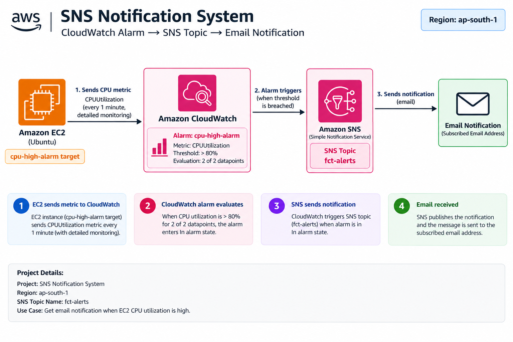
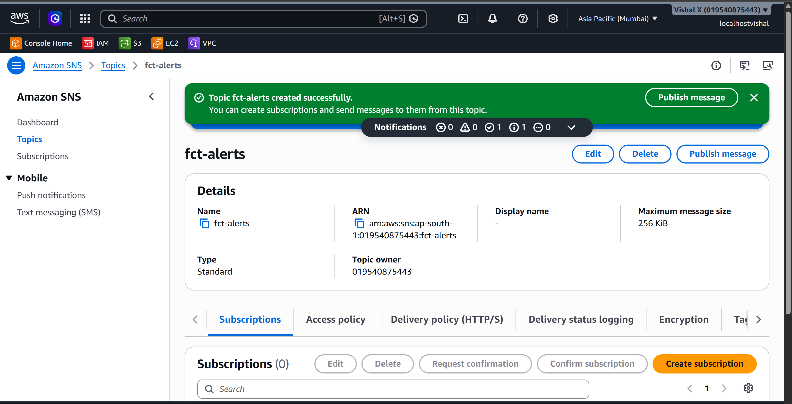
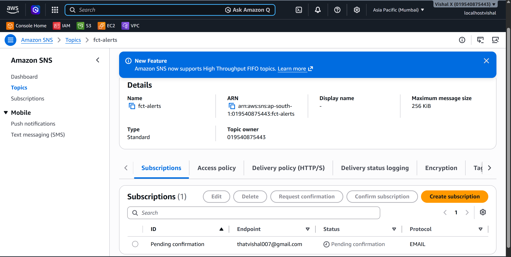
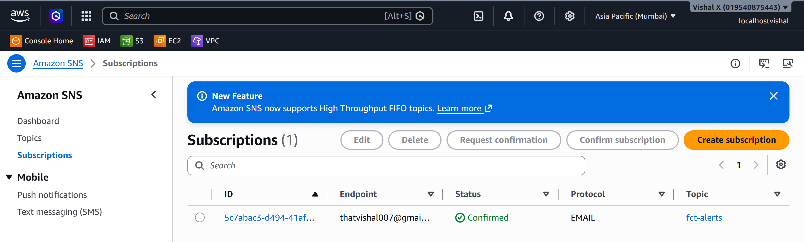
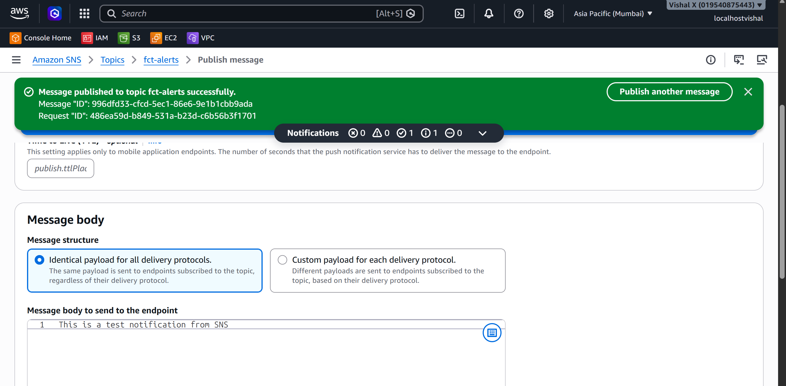
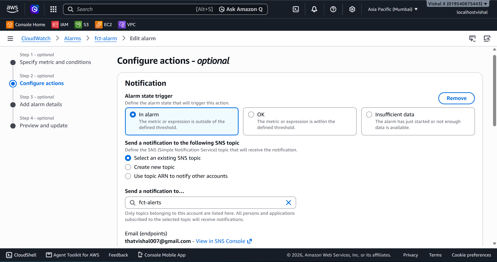
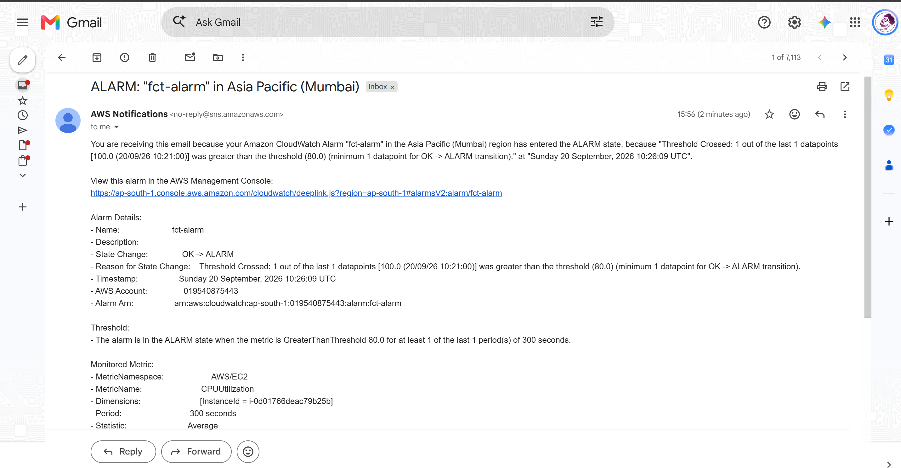

# SNS Notification System

Eleventh project. Built a proper notification system using Amazon SNS — created a topic, added an email subscription, published a test message to verify delivery, then wired it to a CloudWatch alarm so the whole thing fires automatically when a condition is met.

## What I built

An SNS topic with an email subscription connected to a CloudWatch alarm. When the alarm enters the In alarm state, SNS publishes a notification and the email arrives within seconds. I also published a manual test message first to confirm the subscription was working before relying on the alarm to trigger it.



## Why SNS

CloudWatch can detect problems but it can't tell anyone about them on its own. SNS is the bridge — it takes an alarm state change and fans it out to whoever needs to know. One topic can notify an email address, a phone number, a Lambda function, and a webhook all at the same time. Setting this up means the system tells me when something is wrong instead of me having to watch dashboards.

## Services used

| Service | What I used it for |
|---------|-------------------|
| SNS | The notification hub — receives events and fans out to subscribers |
| CloudWatch | Triggers the SNS topic when an alarm condition is met |

## Resources I created

| Resource | Value |
|----------|-------|
| Region | ap-south-1 |
| SNS Topic Name | fct-alerts |
| SNS Topic ARN | arn:aws:sns:ap-south-1:019540875443:fct-alerts |

---

## Steps

### 1. Created the SNS topic

1. Open the **SNS** console
2. In the left sidebar click **Topics** → **Create topic**
3. On the Create topic page:
   - Type: **Standard**
   - Name: `fct-alerts`
   - Leave everything else default
4. Click **Create topic**
5. On the topic detail page, copy the **Topic ARN** — needed when connecting to CloudWatch




---

### 2. Added an email subscription

1. Still on the topic detail page, click the **Subscriptions** tab → **Create subscription**
2. On the Create subscription page:
   - Protocol: **Email**
   - Endpoint: enter the email address to receive alerts
3. Click **Create subscription**

The subscription status shows **Pending confirmation**. Go to the email inbox — AWS sends a confirmation email with subject **AWS Notification - Subscription Confirmation**. Click the **Confirm subscription** link inside it.

To verify: SNS → Topics → `fct-alerts` → Subscriptions tab — status should show **Confirmed**. Notifications won't be delivered until this step is done.







---

### 3. Published a test message

1. SNS → Topics → click `fct-alerts`
2. Click **Publish message**
3. On the Publish message page:
   - Subject: `Test Message`
   - Message body: `This is a test notification from SNS.`
   - Leave everything else default
4. Click **Publish message**

The email arrived within a few seconds. This confirmed the subscription was working before connecting it to an alarm.




---

### 4. Connected to a CloudWatch alarm

1. Open the **CloudWatch** console
2. In the left sidebar click **Alarms** → **All alarms**
3. Click the alarm name → **Actions** → **Edit**
4. Click **Next** to reach the **Configure actions** step
5. On the Configure actions page:
   - Alarm state trigger: **In alarm**
   - Send a notification to an SNS topic: select `fct-alerts`
6. Click **Next** → **Update alarm**

Now when the alarm enters **In alarm** state, it automatically publishes to the SNS topic and delivers to all confirmed subscribers.




---

### 5. Triggered the alarm and verified the notification

SSH'd into the EC2 instance and generated CPU load:

```bash
sudo apt update && sudo apt install stress -y
stress --cpu 2 --timeout 300
```

Back in the CloudWatch console:
1. Click **Alarms** → **All alarms**
2. Watched the alarm state change from **OK** → **In alarm**
3. The email notification arrived within a couple of minutes




---

### 6. Cleaned up

1. SNS → **Subscriptions** → tick the subscription → **Delete** → confirm
2. SNS → **Topics** → tick `veriqta-alerts` → **Delete** → type `delete me` to confirm → **Delete**

---

## Screenshots

| # | File | Description |
|---|------|-------------|
| 01 | `screenshots/01-create-sns-topic.png` | SNS topic created |
| 02 | `screenshots/02-subscription-pending.png` | Email subscription pending confirmation |
| 03 | `screenshots/03-subscription-confirmed.png` | Subscription confirmed |
| 04 | `screenshots/04-publish-test-message.png` | Manual test message published |
| 05 | `screenshots/05-cloudwatch-alarm-connected.png` | CloudWatch alarm with SNS attached |
| 06 | `screenshots/06-alarm-triggered.png` | Email notification received |

## Commands

See [commands/commands.md](./commands/commands.md)

---

## Testing

- Published a manual test message → email arrived within seconds
- Triggered a CloudWatch alarm via CPU stress test → SNS notification delivered automatically

---

## Things that can go wrong

| Problem | What caused it | How I fixed it |
|---------|----------------|----------------|
| No confirmation email | Email went to spam | Checked spam folder |
| Subscription stays Pending confirmation | Confirmation link not clicked | Clicked the link in the AWS email |
| No notification when alarm fires | SNS topic not attached to alarm | Edited the alarm and added the SNS action |
| Email arrives but alarm doesn't fire | Stress test not running long enough | Ran stress for 5 minutes, waited 2 consecutive 1-minute periods above threshold |

---

## Security considerations

- SNS topic only delivers to confirmed subscribers
- For production, restrict who can publish to the topic using an SNS access policy
- Don't commit real email addresses to documentation

---

## Cost

SNS email notifications are free for the first 1,000 per month. SMS notifications cost per message. Delete the topic and subscriptions after the exercise.

---

## What I learned

- SNS is a pub/sub service — one event can notify many subscribers at once
- Subscriptions must be confirmed before they receive messages
- CloudWatch alarms integrate directly with SNS for automated alerting
- Publishing a manual test message first is the fastest way to confirm the subscription works before relying on an alarm to trigger it
