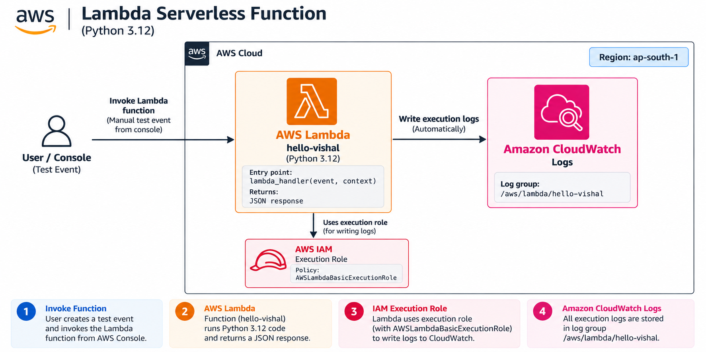
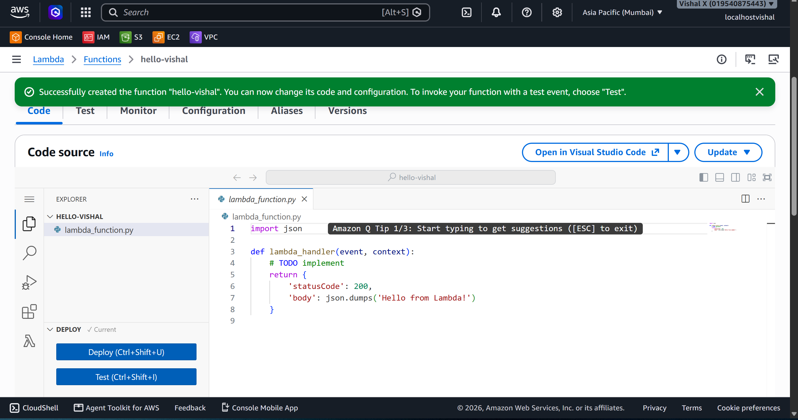
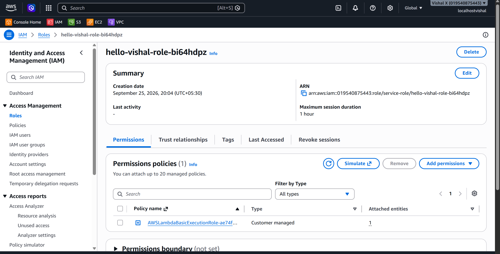
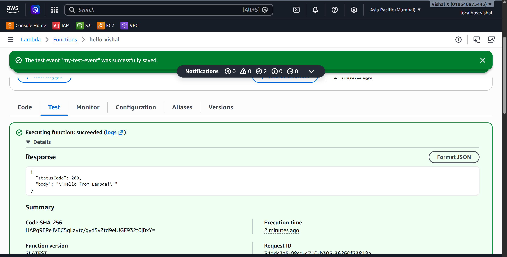
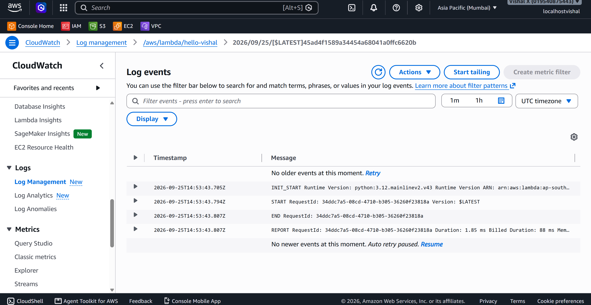
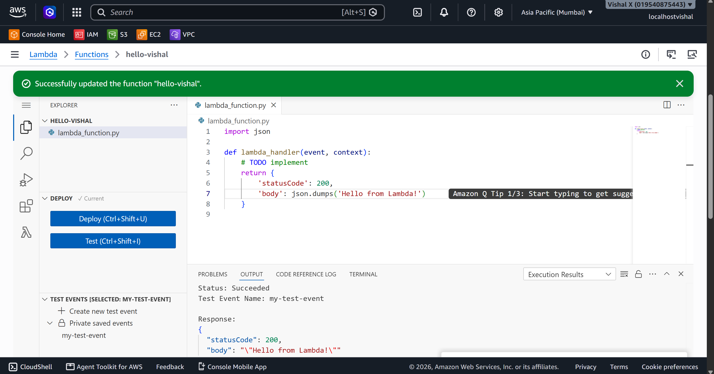

# Lambda Serverless Function

Twelfth project. Wrote and ran my first Lambda function — created a Python function from scratch, tested it with a manual event, viewed the execution logs in CloudWatch, and deliberately broke it to understand how errors surface and get fixed.

## What I built

A Python Lambda function that returns a JSON response when invoked. No servers, no EC2, no OS to manage — just code that runs when triggered. I tested it manually from the console, confirmed the logs appeared in CloudWatch, and introduced a syntax error on purpose to see how Lambda handles failures.

## Why Lambda

Every project before this needed an EC2 instance running 24/7 to execute code. Lambda flips that — the code only runs when something triggers it, and I only pay for the milliseconds it actually executes. Understanding Lambda is the foundation for everything serverless: APIs, file processing, database triggers, scheduled jobs. This project was about getting comfortable with how it works before building anything more complex on top of it.

## Services used

| Service | What I used it for |
|---------|-------------------|
| Lambda | Runs the function code without managing servers |
| IAM | Provides the execution role Lambda uses to run |
| CloudWatch Logs | Stores all Lambda execution logs automatically |

## Resources I created

| Resource | Value |
|----------|-------|
| Region | ap-south-1 |
| Function name | hello-vishal |
| Runtime | Python 3.12 |
| Log group | /aws/lambda/hello-vishal |

---

## Steps

### 1. Created the Lambda function

1. Open the **Lambda** console
2. Click **Functions** → **Create function**
3. On the Create function page:
   - Select **Author from scratch**
   - Function name: `hello-vishal`
   - Runtime: **Python 3.12**
   - Architecture: **x86_64**
   - Permissions: **Create a new role with basic Lambda permissions**
4. Click **Create function**

The console opens the code editor with a default `lambda_handler` function. This is the entry point — Lambda calls this every time the function is invoked.

---

### 2. Reviewed the execution role

1. On the function page, click the **Configuration** tab → **Permissions**
2. Click the role name link — it opens the IAM console
3. The role has `AWSLambdaBasicExecutionRole` attached — this allows Lambda to write logs to CloudWatch

In production, only grant the specific permissions the function actually needs.

---

### 3. Tested the function

1. On the function page, click the **Test** tab
2. Click **Create new event**:
   - Event name: `my-test-event`
   - Template: **hello-world**
   - Leave the default JSON payload
3. Click **Save**
4. Click **Test** to invoke the function

The results panel shows the status code, response body, duration, memory used, and log output.

---

### 4. Viewed CloudWatch logs

1. Open the **CloudWatch** console
2. In the left sidebar click **Log groups**
3. Click `/aws/lambda/hello-vishal`
4. Click the latest log stream

Each log stream corresponds to a Lambda execution. The logs show:
- `START` — invocation started
- Any `print()` output from the code
- `END` — function finished
- `REPORT` — duration, memory used, billed duration

---

### 5. Introduced and fixed an error

Introduced a syntax error in the code, clicked **Deploy**, then **Test**. The results panel showed the error immediately.

Fixed the code, clicked **Deploy** again, then **Test** — execution succeeded.

Key rule: always click **Deploy** after editing code. Changes don't take effect until deployed.

---

### 6. Cleaned up

1. Lambda → **Functions** → tick `hello-vishal` → **Actions** → **Delete** → type `delete` to confirm → **Delete**

---

## Screenshots

| # | File | Description |
|---|------|-------------|
| 01 | `screenshots/01-lambda-function-created.png` | Lambda function created with code editor |
| 02 | `screenshots/02-execution-role.png` | IAM execution role with basic Lambda permissions |
| 03 | `screenshots/03-test-function.png` | Successful test execution with response |
| 04 | `screenshots/04-cloudwatch-logs.png` | CloudWatch log stream showing START/END/REPORT |
| 05 | `screenshots/05-error-fixed.png` | Successful re-test after fixing the error |

## Commands

See [commands/commands.md](./commands/commands.md)

---

## Testing

- Created a test event using the hello-world template
- Invoked the function manually and verified the response
- Confirmed logs appeared in CloudWatch
- Introduced a syntax error, observed the failure, fixed it, and re-tested

---

## Things that can go wrong

| Problem | What caused it | How I fixed it |
|---------|----------------|----------------|
| No logs in CloudWatch | Execution role missing CloudWatch permissions | Attached AWSLambdaBasicExecutionRole |
| Code changes not taking effect | Forgot to click Deploy | Clicked Deploy before testing |
| Test event not found | Event not saved | Created and saved the test event first |
| Function times out | Default 3-second timeout too short | Increased timeout in Configuration → General configuration |

---

## Security considerations

- The execution role should only have permissions the function actually needs
- Never hardcode credentials in Lambda code — use environment variables or IAM roles
- If exposing Lambda via a function URL, enable authentication

---

## Cost

Lambda free tier: 1 million requests and 400,000 GB-seconds per month. For a simple hello-world function the cost is effectively zero. Delete the function after the exercise if not needed.

---

## What I learned

- Lambda is truly serverless — no EC2, no OS, just code that runs when triggered
- The execution role controls what AWS services the function can access
- CloudWatch Logs captures every invocation automatically — no setup needed
- The Deploy button must be clicked after editing code before testing
- Lambda scales automatically — no configuration needed for that
