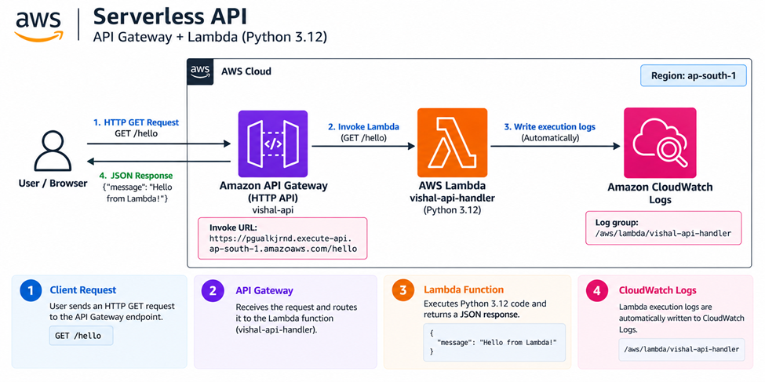
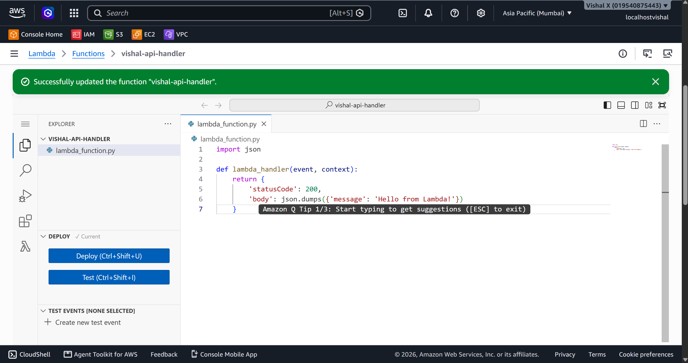
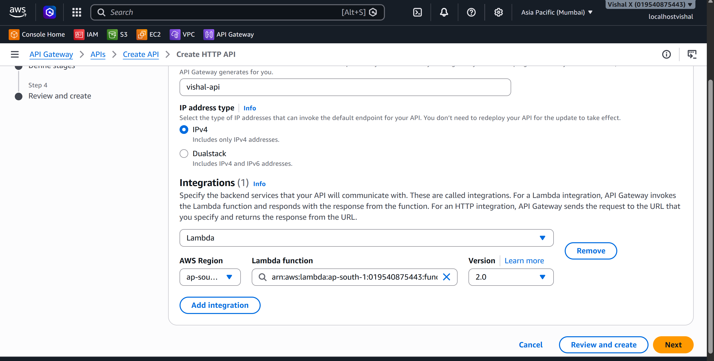
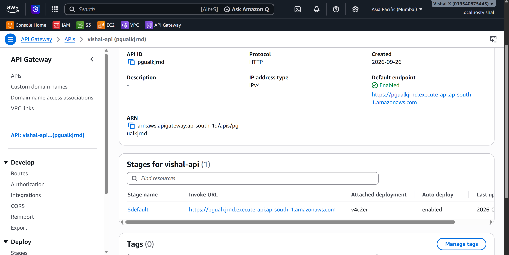
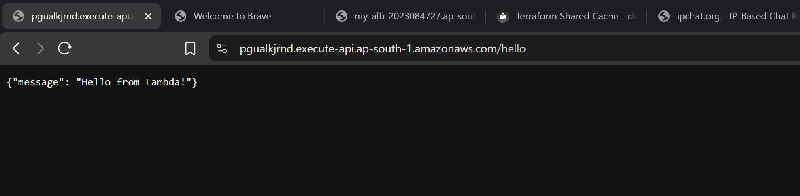
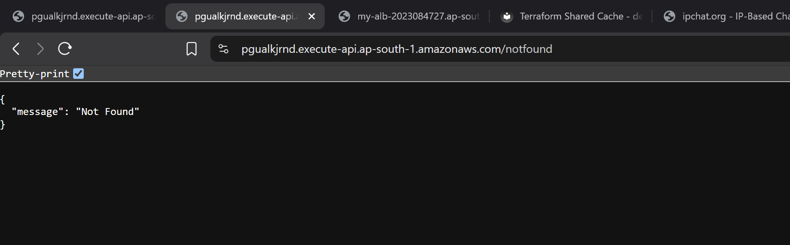
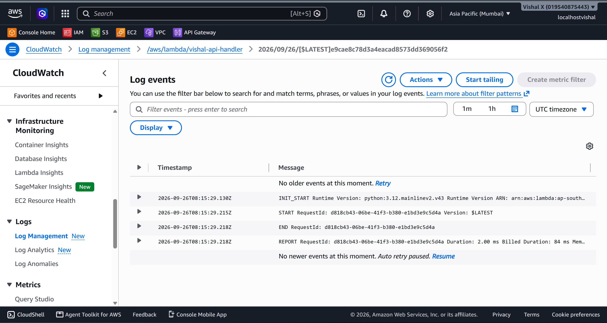

# Serverless API

Thirteenth project. Connected API Gateway to a Lambda function to build a real HTTP API — no servers, no EC2, no load balancer. Created the Lambda function, built an HTTP API in API Gateway, wired them together, deployed it, and called the endpoint from a browser.

## What I built

An HTTP API endpoint backed by a Lambda function. API Gateway sits in front and handles all the HTTP — when a GET request hits `/hello`, it invokes the Lambda function, which returns a JSON response. The whole thing deploys in minutes and scales automatically without any configuration.



## Why API Gateway

Lambda on its own has no HTTP interface — you can invoke it from the console or CLI but not from a browser or mobile app. API Gateway is the front door. It takes an HTTP request, routes it to the right Lambda function, and sends the response back to the caller. Together they form the core of a serverless backend — no servers to manage, no load balancers to configure, pay only for what gets called.

## Services used

| Service | What I used it for |
|---------|-------------------|
| API Gateway | Receives HTTP requests and routes them to Lambda |
| Lambda | Processes the request and returns a JSON response |
| CloudWatch Logs | Stores Lambda execution logs automatically |

## Resources I created

| Resource | Value |
|----------|-------|
| Region | ap-south-1 |
| Function name | vishal-api-handler |
| API name | vishal-api |
| Route | GET /hello |
| Log group | /aws/lambda/vishal-api-handler |

---

## Steps

### 1. Created the Lambda function

1. Open the **Lambda** console
2. Click **Functions** → **Create function**
3. On the Create function page:
   - Select **Author from scratch**
   - Function name: `vishal-api-handler`
   - Runtime: **Python 3.12**
   - Architecture: **x86_64**
   - Permissions: **Create a new role with basic Lambda permissions**
4. Click **Create function**
5. In the code editor, replace the default code with:

```python
import json

def lambda_handler(event, context):
    return {
        'statusCode': 200,
        'body': json.dumps({'message': 'Hello from Lambda!'})
    }
```

6. Click **Deploy**

The function must return a proper HTTP response object — `statusCode` and `body` are required. API Gateway reads these to build the HTTP response it sends back to the caller.




---

### 2. Created the HTTP API

1. Open the **API Gateway** console
2. Click **Create API**
3. Under **HTTP API** click **Build**
4. On the Create an API page:
   - Click **Add integration**
     - Integration type: **Lambda**
     - Lambda function: select `vishal-api-handler`
   - API name: `vishal-api`
5. Click **Next**




---

### 3. Configured the route and deployed

Still in the API creation wizard:

1. On the **Configure routes** page:
   - Method: **GET**
   - Resource path: `/hello`
   - Integration target: `vishal-api-handler` (already set from the previous step)
2. Click **Next**
3. On the **Define stages** page:
   - Stage name: `$default`
   - Auto-deploy: **enabled**
4. Click **Next** → **Create**

After creation, the **Invoke URL** appears at the top of the API page. The full endpoint to call is `https://pgualkjrnd.execute-api.ap-south-1.amazonaws.com/hello`.

Auto-deploy means any future changes to routes or integrations go live immediately — no manual deploy step needed.




---

### 4. Called the API from a browser

Opened a browser and went to `https://pgualkjrnd.execute-api.ap-south-1.amazonaws.com/hello`.

API Gateway received the GET request, forwarded it to Lambda, Lambda ran the handler, and the JSON response came back:

```json
{"message": "Hello from Lambda!"}
```



---

### 5. Tested with a missing route

Tried a path that doesn't exist:

```
https://pgualkjrnd.execute-api.ap-south-1.amazonaws.com/notfound
```

API Gateway returned `{"message":"Not Found"}` with a `404` status automatically — no configuration needed for that.




---

### 6. Reviewed CloudWatch logs

1. Open the **CloudWatch** console
2. In the left sidebar click **Log groups**
3. Click `/aws/lambda/vishal-api-handler`
4. Open the latest log stream

Each API call creates a log entry showing the full event object that API Gateway sent to Lambda, the function output, duration, and memory used. Useful for debugging when the response isn't what's expected.




---

### 7. Cleaned up

1. API Gateway → **APIs** → tick `vishal-api` → **Actions** → **Delete** → confirm
2. Lambda → **Functions** → tick `vishal-api-handler` → **Actions** → **Delete** → type `delete` to confirm → **Delete**

---

## Screenshots

| # | File | Description |
|---|------|-------------|
| 01 | `screenshots/01-lambda-function.png` | Lambda code editor showing the handler deployed |
| 02 | `screenshots/02-api-gateway-create.png` | HTTP API creation with Lambda integration configured |
| 03 | `screenshots/03-api-endpoint.png` | API Gateway page showing the Invoke URL and /hello route |
| 04 | `screenshots/04-api-response.png` | Browser showing the JSON response from the API |
| 05 | `screenshots/05-api-test.png` | 404 response for an undefined route |
| 06 | `screenshots/06-cloudwatch-logs.png` | CloudWatch log stream showing Lambda invocation from API Gateway |

## Commands

See [commands/commands.md](./commands/commands.md)

---

## Testing

- Called `https://pgualkjrnd.execute-api.ap-south-1.amazonaws.com/hello` in a browser and got `200 OK` with JSON body
- Tested a non-existent route and confirmed `404` response
- Verified Lambda logs appeared in CloudWatch after each call

---

## Things that can go wrong

| Problem | What caused it | How I fixed it |
|---------|----------------|----------------|
| 500 Internal Server Error | Lambda function threw an exception | Checked CloudWatch logs for the traceback |
| 403 Forbidden | API Gateway couldn't invoke Lambda | Checked the Lambda resource-based policy allows API Gateway |
| No response in browser | API not deployed | Confirmed auto-deploy was enabled on the stage |
| Wrong response format | Lambda not returning statusCode | Made sure the handler returns `{'statusCode': 200, 'body': ...}` |

---

## Security considerations

- HTTP APIs have no authentication by default — anyone with the URL can call it
- For production, add a JWT authorizer or IAM authorization on the route
- HTTPS is enforced by API Gateway automatically — no HTTP option

---

## Cost

API Gateway HTTP API: first 1 million requests per month free for 12 months. Lambda: first 1 million requests per month always free. For a test project the cost is effectively zero. Delete the API and function after the exercise.

---

## What I learned

- API Gateway is the HTTP front door for Lambda — without it, Lambda has no web interface
- The Lambda function must return `statusCode` and `body` — API Gateway uses these to build the HTTP response
- HTTP APIs are simpler and cheaper than REST APIs for basic use cases
- Auto-deploy means route and integration changes go live immediately
- Every API call is logged in CloudWatch automatically — no setup needed
