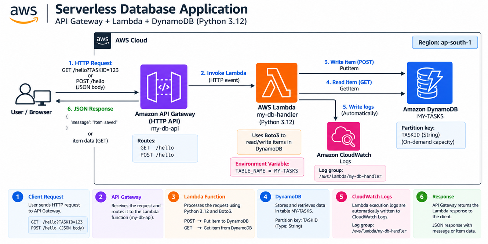
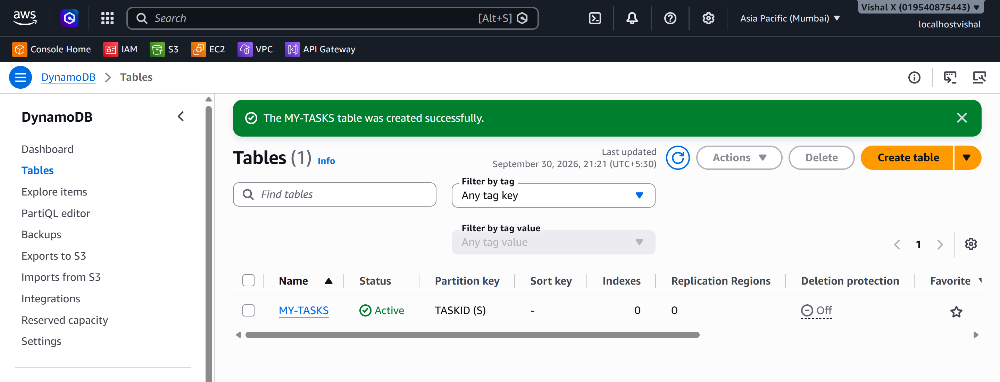
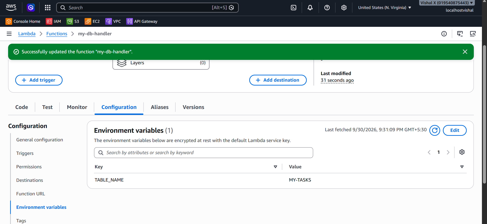
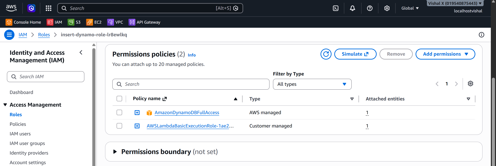
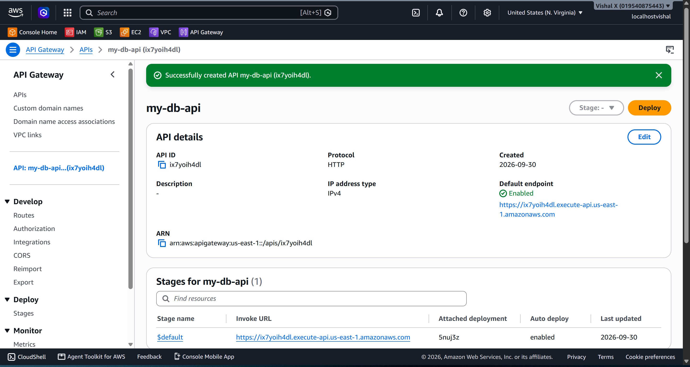
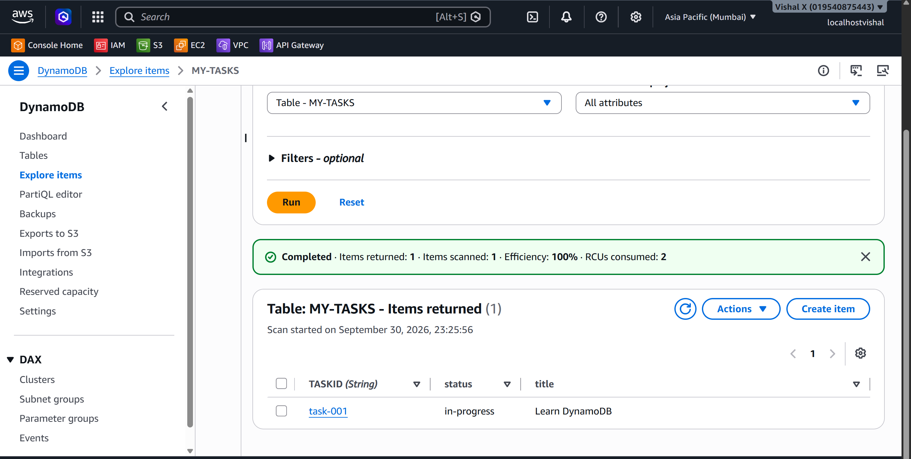
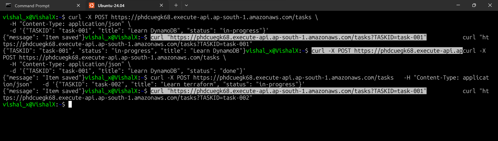
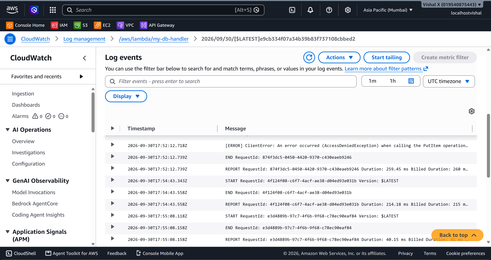

# Serverless Database Application

Fourteenth project. Connected Lambda to DynamoDB to build a serverless database application — created a DynamoDB table, wrote a Lambda function using Boto3 to read and write items, attached the right IAM permissions, and wired it all together through API Gateway.

## What I built

A fully serverless stack where API Gateway receives HTTP requests, Lambda processes them using Boto3, and DynamoDB stores the data. POST to write an item, GET to read it back. No EC2, no RDS, no servers to manage.



## Why DynamoDB

Every project before this that needed a database used RDS — a relational database running on a managed server. DynamoDB is different. It's a NoSQL key-value store that's fully serverless, scales automatically, and charges per request. For a Lambda-based backend it's the natural fit — both scale to zero, both scale up automatically, and neither needs a server running 24/7.

## Services used

| Service | What I used it for |
|---------|-------------------|
| DynamoDB | NoSQL table that stores the application data |
| Lambda | Processes requests and reads/writes to DynamoDB using Boto3 |
| API Gateway | Receives HTTP requests and routes them to Lambda |
| IAM | Grants Lambda permission to access DynamoDB |
| CloudWatch Logs | Stores Lambda execution logs automatically |

## Resources I created

| Resource | Value |
|----------|-------|
| Region | ap-south-1 |
| DynamoDB table | MY-TASKS |
| Partition key | TASKID (String) |
| Lambda function | my-db-handler |
| API name | my-db-api |
| Log group | /aws/lambda/my-db-handler |

---

## Steps

### 1. Created the DynamoDB table

1. Open the **DynamoDB** console
2. Click **Tables** → **Create table**
3. On the Create table page:
   - Table name: `MY-TASKS`
   - Partition key: `TASKID` — type **String**
   - Leave all other settings default (on-demand capacity)
4. Click **Create table**
5. Wait for the table status to show **Active**

The partition key is the primary identifier — every item in the table must have a unique TASKID.

> 📸 Screenshot required: DynamoDB table overview showing table name MY-TASKS, status Active, and partition key TASKID



---

### 2. Created the Lambda function

1. Open the **Lambda** console
2. Click **Functions** → **Create function**
3. On the Create function page:
   - Select **Author from scratch**
   - Function name: `my-db-handler`
   - Runtime: **Python 3.12**
   - Permissions: **Create a new role with basic Lambda permissions**
4. Click **Create function**
5. On the function page, click **Configuration** tab → **Environment variables** → **Edit** → **Add environment variable**:
   - Key: `TABLE_NAME`
   - Value: `MY-TASKS`
6. Click **Save**
7. Back on the **Code** tab, replace the default code with:

```python
import json
import boto3
import os

dynamodb = boto3.resource('dynamodb')
table = dynamodb.Table(os.environ['TABLE_NAME'])

def lambda_handler(event, context):
    method = event.get('requestContext', {}).get('http', {}).get('method', 'GET')
    
    if method == 'POST':
        body = json.loads(event.get('body', '{}'))
        table.put_item(Item=body)
        return {'statusCode': 200, 'body': json.dumps({'message': 'Item saved'})}
    
    elif method == 'GET':
        params = event.get('queryStringParameters') or {}
        task_id = params.get('TASKID')
        if not task_id:
            return {'statusCode': 400, 'body': json.dumps({'error': 'TASKID required'})}
        response = table.get_item(Key={'TASKID': task_id})
        item = response.get('Item')
        if not item:
            return {'statusCode': 404, 'body': json.dumps({'error': 'Not found'})}
        return {'statusCode': 200, 'body': json.dumps(item)}
    
    return {'statusCode': 405, 'body': json.dumps({'error': 'Method not allowed'})}
```

8. Click **Deploy**

The table name comes from an environment variable — keeps configuration out of the code.

> 📸 Screenshot required: Lambda function code tab showing the handler deployed, and the Configuration tab showing the TABLE_NAME environment variable set to MY-TASKS



---

### 3. Configured IAM permissions

1. Open the **IAM** console
2. Click **Roles** → search for the role created for `my-db-handler` → click it
3. Click **Add permissions** → **Attach policies**
4. Search for `AmazonDynamoDBFullAccess` → tick it → **Add permissions**

Without this, Lambda throws `AccessDeniedException` when trying to read or write to DynamoDB.

> 📸 Screenshot required: IAM role for the Lambda function showing AmazonDynamoDBFullAccess attached in the permissions policies list



---

### 4. Connected Lambda to API Gateway

Same process as Project 13 — create an HTTP API with GET and POST routes both pointing to `veriqta-db-handler`.

1. API Gateway → **Create API** → **HTTP API** → **Build**
2. Add integration: Lambda → `my-db-handler`
3. API name: `my-db-api`
4. Add two routes:
   - **GET** `/tasks`
   - **POST** `/tasks`
5. Stage: `$default`, auto-deploy enabled
6. Click **Create**

Copy the Invoke URL from the API page.

> 📸 Screenshot required: API Gateway page showing the my-db-api with GET /tasks and POST /tasks routes listed and the Invoke URL visible



---

### 5. Wrote and read data

**Write — POST request:**

```bash
curl -X POST MY_API_ENDPOINT/tasks \
  -H "Content-Type: application/json" \
  -d '{"TASKID": "task-001", "title": "Learn DynamoDB", "status": "in-progress"}'
```

**Read — GET request:**

```bash
curl "MY_API_ENDPOINT/tasks?TASKID=task-001"
```

To verify in the console: DynamoDB → Tables → `MY-TASKS` → **Explore table items** — the item should appear.

> 📸 Screenshot required: DynamoDB Explore items view showing the item written by Lambda with TASKID, title, and status visible



---

### 6. Verified the full workflow

1. Sent a POST request — item created
2. Checked DynamoDB console — item visible
3. Sent a GET request — item returned as JSON
4. Checked CloudWatch logs — Lambda execution confirmed

> 📸 Screenshot required: Terminal showing the POST and GET curl commands with successful JSON responses



> 📸 Screenshot required: CloudWatch log stream showing Lambda reading and writing to DynamoDB with START/END/REPORT entries



---

### 7. Cleaned up

1. API Gateway → APIs → delete `my-db-api`
2. Lambda → Functions → tick `my-db-handler` → **Actions** → **Delete** → confirm
3. DynamoDB → Tables → tick `MY-TASKS` → **Delete** → confirm

---

## Screenshots

| # | File | Description |
|---|------|-------------|
| 01 | `screenshots/01-dynamodb-table.png` | DynamoDB table created with status Active |
| 02 | `screenshots/02-lambda-function.png` | Lambda function code and TABLE_NAME environment variable |
| 03 | `screenshots/03-iam-permissions.png` | IAM role with AmazonDynamoDBFullAccess attached |
| 04 | `screenshots/04-api-gateway.png` | API Gateway with GET and POST routes configured |
| 05 | `screenshots/05-dynamodb-items.png` | DynamoDB Explore items showing the written item |
| 06 | `screenshots/06-test-workflow.png` | Terminal showing POST and GET requests with responses |
| 07 | `screenshots/07-cloudwatch-logs.png` | CloudWatch logs showing Lambda execution |

## Commands

See [commands/commands.md](./commands/commands.md)

---

## Testing

- POST request created an item in DynamoDB
- GET request retrieved the item by TASKID
- Verified item visible in DynamoDB console
- Confirmed CloudWatch logs showed successful execution

---

## Things that can go wrong

| Problem | What caused it | How I fixed it |
|---------|----------------|----------------|
| AccessDeniedException | Lambda role missing DynamoDB permissions | Attached AmazonDynamoDBFullAccess to the role |
| ResourceNotFoundException | Wrong table name in environment variable | Checked TABLE_NAME matches the actual table name exactly |
| 400 error on GET | TASKID not in query string | Added `?TASKID=task-001` to the URL |
| Item not found | Wrong TASKID or item not created | Checked DynamoDB console for the item |

---

## Security considerations

- Never hardcode AWS credentials in Lambda code — use the execution role
- In production, use a least-privilege policy instead of AmazonDynamoDBFullAccess
- Enable DynamoDB encryption at rest (enabled by default)

---

## Cost

DynamoDB on-demand: pay per request — effectively zero for a test project. Lambda: first 1 million requests per month are free. Delete the table, function, and API after the exercise.

---

## What I learned

- DynamoDB is a NoSQL key-value store — the partition key is the primary identifier for every item
- Boto3 is the Python SDK for AWS — `dynamodb.Table()` gives a clean interface for reads and writes
- Lambda needs explicit IAM permissions to access other AWS services — it doesn't get them automatically
- Environment variables keep configuration out of the code
- The full serverless stack (API Gateway + Lambda + DynamoDB) requires no servers at all

