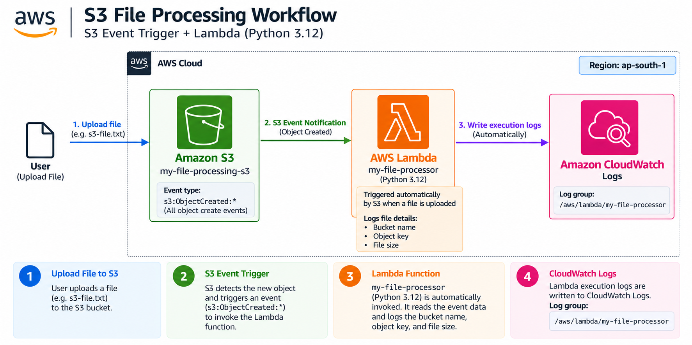
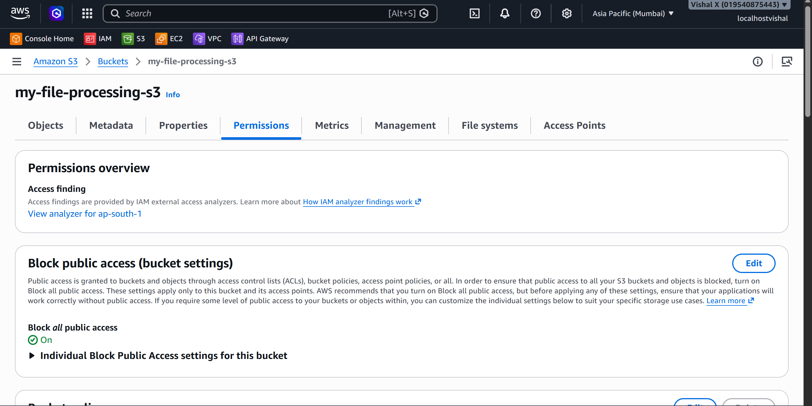
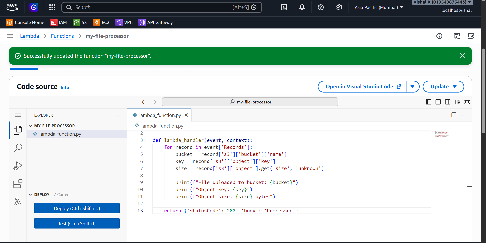
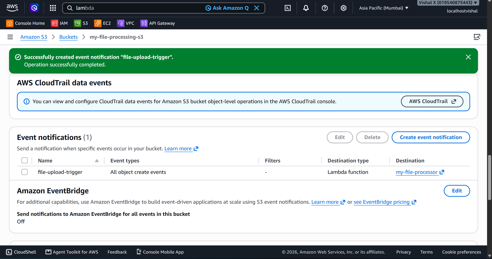
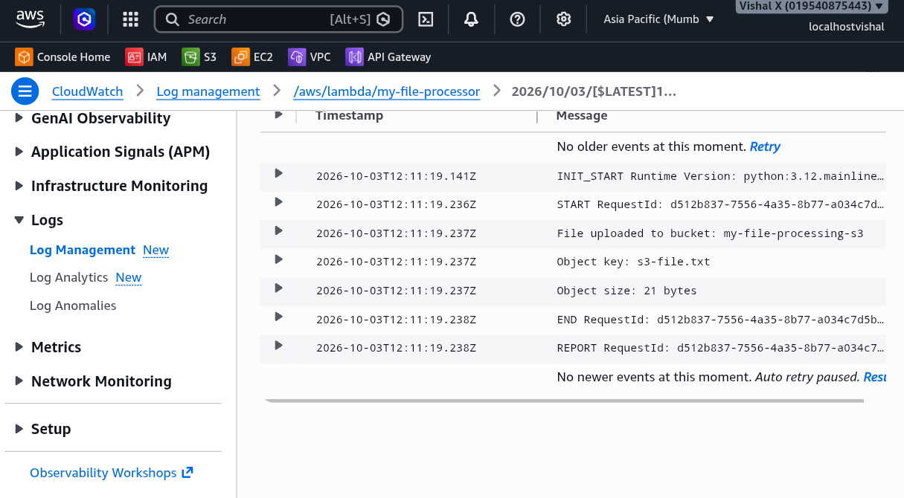
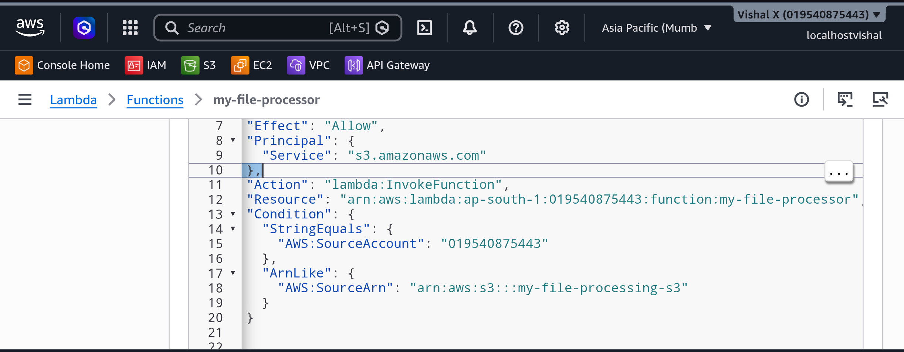

# S3 File Processing Workflow

Fifteenth project. Made Lambda react automatically to S3 events — when a file is uploaded to an S3 bucket, S3 fires an event that triggers a Lambda function. No polling, no cron jobs, just an automatic reaction. Set up the bucket, configured the event notification, wrote the Lambda function, and verified it through CloudWatch logs.

## What I built

An event-driven file processing workflow. Upload a file to S3, Lambda fires automatically, logs the bucket name, object key, and file size to CloudWatch. The whole thing is triggered by the upload — nothing else needs to happen.



## Why S3 event triggers

Lambda can be triggered by dozens of AWS services — S3 is one of the most common. The pattern is everywhere: a file lands in S3, Lambda processes it, the result goes somewhere else. Image resizing, CSV parsing, log processing, virus scanning — all of it works this way. This project was about understanding how the trigger mechanism works before building anything more complex on top of it.

## Services used

| Service | What I used it for |
|---------|-------------------|
| S3 | Stores files and fires events when objects are created |
| Lambda | Automatically triggered by S3 events to process file metadata |
| CloudWatch Logs | Stores Lambda execution logs for verification |

## Resources I created

| Resource | Value |
|----------|-------|
| Region | ap-south-1 |
| S3 bucket | veriqta-file-processing |
| Lambda function | veriqta-file-processor |
| Event type | s3:ObjectCreated:* |
| Log group | /aws/lambda/veriqta-file-processor |

---

## Steps

### 1. Created the S3 bucket

1. Open the **S3** console
2. Click **Create bucket**
3. On the Create bucket page:
   - Bucket name: something globally unique (e.g. `my-file-processing-s3`)
   - Region: same region as the Lambda function
   - Block all public access: **leave enabled**
   - Leave everything else default
4. Click **Create bucket**




---

### 2. Created the Lambda function

1. Open the **Lambda** console
2. Click **Functions** → **Create function**
3. On the Create function page:
   - Select **Author from scratch**
   - Function name: `my-file-processor`
   - Runtime: **Python 3.12**
   - Permissions: **Create a new role with basic Lambda permissions**
4. Click **Create function**
5. In the code editor, replace the default code with:

```python
import json

def lambda_handler(event, context):
    for record in event['Records']:
        bucket = record['s3']['bucket']['name']
        key = record['s3']['object']['key']
        size = record['s3']['object'].get('size', 'unknown')
        
        print(f"File uploaded to bucket: {bucket}")
        print(f"Object key: {key}")
        print(f"Object size: {size} bytes")
    
    return {'statusCode': 200, 'body': 'Processed'}
```

6. Click **Deploy**




---

### 3. Configured the S3 event notification

1. Open the **S3** console → click the bucket name
2. Click the **Properties** tab
3. Scroll down to **Event notifications** → **Create event notification**
4. On the Create event notification page:
   - Event name: `file-upload-trigger`
   - Event types: tick **All object create events** (`s3:ObjectCreated:*`)
   - Destination: **Lambda function**
   - Lambda function: select `my-file-processor`
5. Click **Save changes**

S3 automatically adds a resource-based policy to the Lambda function allowing S3 to invoke it — no manual IAM step needed.




---


### 4. Uploaded a test file and verified in CloudWatch

1. S3 → click the bucket → **Upload** → **Add files** → select any `.txt` file → **Upload**
2. Open the **CloudWatch** console
3. In the left sidebar click **Log groups**
4. Click `/aws/lambda/my-file-processor`
5. Open the latest log stream

The log shows the bucket name, object key, and file size printed by the function — confirming Lambda was triggered automatically by the upload.




---

### 5. Checked the Lambda resource-based policy

If Lambda is not triggered after uploading:

1. Lambda → Functions → 'my-file-processor` → **Configuration** tab → **Resource-based policy statements**
2. Confirm S3 has permission to invoke the function
3. Also check: S3 bucket and Lambda must be in the **same region**




---

### 6. Cleaned up

1. Lambda → Functions → tick `my-file-processor` → **Actions** → **Delete** → confirm
2. S3 → tick the bucket → **Empty** → confirm → then **Delete** → confirm

---

## Screenshots

| # | File | Description |
|---|------|-------------|
| 01 | `screenshots/01-s3-bucket.png` | S3 bucket created with Block Public Access enabled |
| 02 | `screenshots/02-lambda-function.png` | Lambda function code showing the S3 event handler |
| 03 | `screenshots/03-s3-event-notification.png` | S3 event notification configured with Lambda destination |
| 04 | `screenshots/04-cloudwatch-logs.png` | CloudWatch logs showing bucket name, object key, and file size |
| 05 | `screenshots/05-resource-policy.png` | Lambda resource-based policy showing S3 invoke permission |

## Commands

See [commands/commands.md](./commands/commands.md)

---

## Testing

- Uploaded a test file to the S3 bucket
- Verified Lambda was triggered automatically
- Confirmed CloudWatch logs showed the bucket name, object key, and file size

---

## Things that can go wrong

| Problem | What caused it | How I fixed it |
|---------|----------------|----------------|
| Lambda not triggered | Event notification not saved correctly | Re-checked S3 event notification configuration |
| Permission denied | S3 can't invoke Lambda | Checked Lambda resource-based policy statements |
| No logs in CloudWatch | Lambda not invoked at all | Verified the event notification points to the right function |
| Wrong region error | Bucket and Lambda in different regions | Used the same region for both |

---

## Security considerations

- S3 bucket stays private — no public access needed for this workflow
- Lambda execution role only needs CloudWatch Logs write permission for this project
- If Lambda needs to read the file content, add `s3:GetObject` to the execution role

---

## Cost

S3 event notifications are free. Lambda: first 1 million requests per month are free. S3 storage is minimal for test files. Delete the bucket and function after the exercise.

---

## What I learned

- S3 can trigger Lambda automatically when files are uploaded — no polling needed
- The S3 event object passed to Lambda contains all the metadata about the uploaded file
- S3 automatically adds the Lambda invoke permission when configuring the event notification
- The bucket and Lambda function must be in the same region for the trigger to work
- This pattern is the foundation of serverless file processing pipelines

