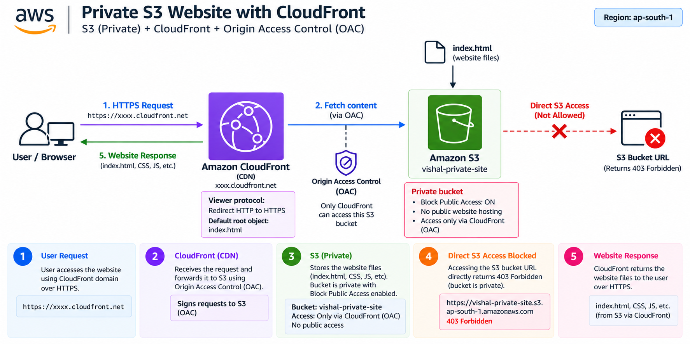
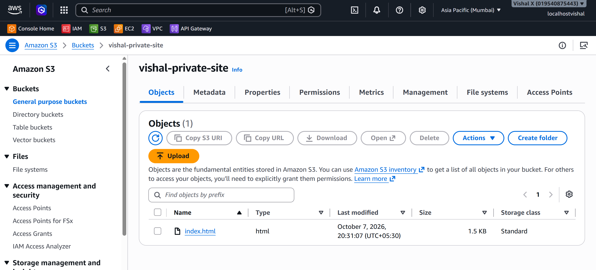
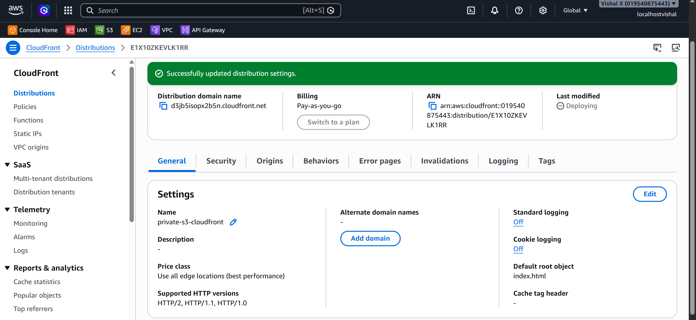
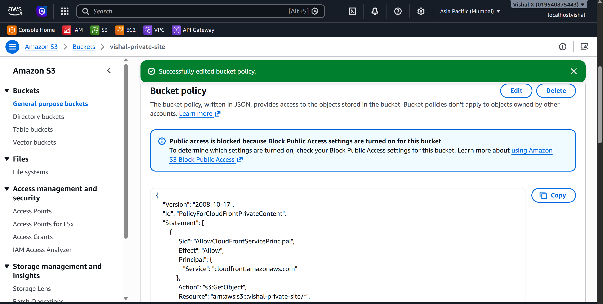
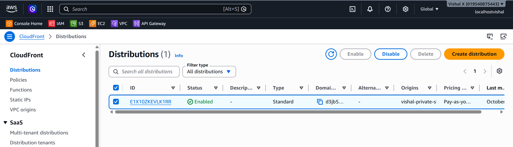
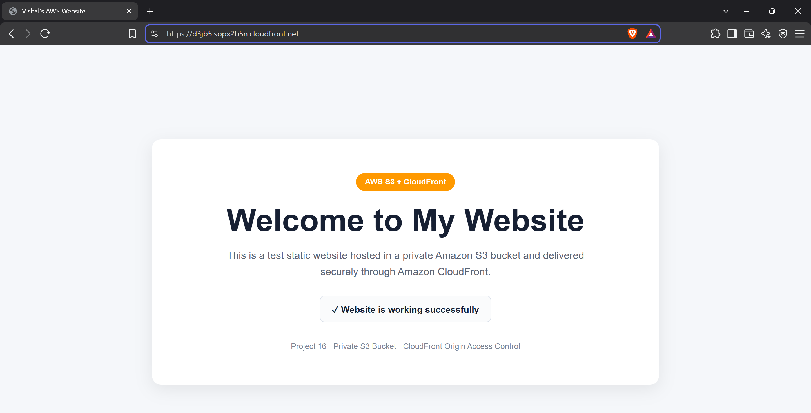
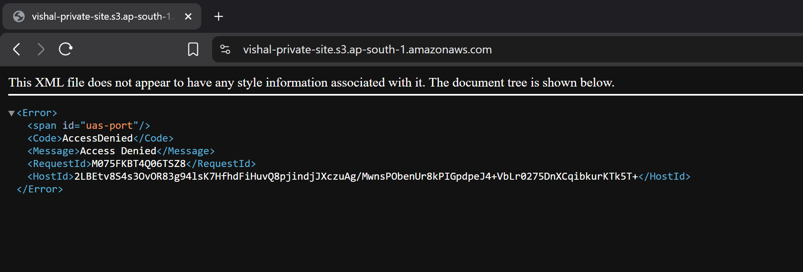

# Private S3 Website with CloudFront

Sixteenth project. Hosted a website on S3 while keeping the bucket completely private. Used CloudFront with Origin Access Control so only CloudFront can read from the bucket — users get the site over HTTPS, the S3 URL returns 403.

## What I built

A static website served through CloudFront from a private S3 bucket. Block Public Access is on — direct S3 access returns 403. CloudFront sits in front with OAC, so it's the only thing that can read from the bucket. All traffic goes over HTTPS.

## Why OAC instead of public S3

Project 2 made the S3 bucket public to host a website. That works but it's not the right way to do it — anyone can hit the S3 URL directly and bypass CloudFront entirely. OAC locks the bucket down so only this specific CloudFront distribution can read from it. Users still get the site, but through CloudFront, which adds HTTPS, caching, and global edge delivery.

## Services used

| Service | What I used it for |
|---------|-------------------|
| S3 | Stores the website files — kept private, no public access |
| CloudFront | CDN that serves the content globally over HTTPS |
| OAC | Restricts S3 access to CloudFront only |

## Resources I created

| Resource | Value |
|----------|-------|
| Region | ap-south-1 |
| S3 bucket | vishal-private-site- |
| CloudFront domain | d3jb5isopx2b5n.cloudfront.net |
| Default root object | index.html |
| Viewer protocol | Redirect HTTP to HTTPS |

---

## Steps

### 1. Created a private S3 bucket and uploaded files

1. Open the **S3** console
2. Click **Create bucket**
3. On the Create bucket page:
   - Bucket name: `vishal-private-site`
   - Region: any
   - Block all public access: **leave enabled** — this is intentional
   - Leave everything else default
4. Click **Create bucket**
5. Click the bucket name → **Upload** → **Add files** → upload `index.html` → **Upload**

Do not enable static website hosting on the bucket — CloudFront handles that.

---

### 2. Created the CloudFront distribution with OAC

1. Open the **CloudFront** console
2. Click **Create a CloudFront distribution**

**Origin section:**
- Origin domain: click the field and select the S3 bucket from the dropdown — it shows as `vishal-private-site.s3.ap-south-1.amazonaws.com`
- A prompt may appear saying *"Use website endpoint"* — click **Use S3 bucket** (not the website endpoint)
- Origin path: leave empty
- Name: leave as auto-filled
- Origin access: select **Origin access control settings (recommended)**
  - Click **Create new OAC**
  - Name: leave default (auto-filled with the bucket name)
  - Signing behavior: **Sign requests (recommended)**
  - Click **Create**
- The OAC name now appears selected under Origin access control

**Default cache behavior section:**
- Viewer protocol policy: **Redirect HTTP to HTTPS**
- Allowed HTTP methods: **GET, HEAD**
- Leave everything else default

**Web Application Firewall (WAF) section:**
- Select **Do not enable security protections** (free option for this project)

**Settings section:**
- Price class: **Use only North America and Europe**
- Leave everything else default

3. Click **Create distribution**

After creation, a green banner appears: *"Successfully created new distribution"*. Below it there's also a notice saying the S3 bucket policy needs to be updated — click **Copy policy** button in that notice to copy it to clipboard.

Now set the default root object (this option is not shown during creation — it's set after):
1. Click into the distribution → **General** tab → scroll down to **Settings** → click **Edit**
2. Find **Default root object** → type `index.html`
3. Click **Save changes**

---

### 3. Updated the S3 bucket policy

1. Open the **S3** console → click the bucket name
2. Click the **Permissions** tab → scroll down to **Bucket policy** → click **Edit**
3. Paste the policy copied from the CloudFront notice in Step 2 (it's already in the clipboard)
4. Click **Save changes**

The policy allows only this specific CloudFront distribution to read objects from the bucket — nothing else.

---

### 4. Waited for the distribution to deploy

1. CloudFront → **Distributions**
2. Wait for the distribution status to change from **Deploying** to **Enabled** — takes a few minutes

---

### 5. Tested the site

1. Copy the **Domain name** from the CloudFront distribution page 
2. Open it in a browser — the website loads over HTTPS
3. Try the S3 bucket URL directly — it returns `AccessDenied` (correct, the bucket is private)

After updating files in S3, to clear the CloudFront cache:
1. CloudFront → select the distribution → **Invalidations** tab → **Create invalidation**
2. Object paths: `/*`
3. Click **Create invalidation**

---

### 6. Cleaned up

1. CloudFront → select the distribution → **Disable** → wait for status update → **Delete**
2. S3 → tick the bucket → **Empty** → confirm → then **Delete** → confirm

---

## Screenshots

| # | File | Description |
|---|------|-------------|
| 01 | `screenshots/01-s3-bucket.png` | S3 bucket with uploaded files and Block Public Access enabled |
| 02 | `screenshots/02-cloudfront-distribution.png` | CloudFront distribution with OAC and bucket policy banner |
| 03 | `screenshots/03-bucket-policy.png` | S3 bucket policy with CloudFront distribution ARN |
| 04 | `screenshots/04-distribution-enabled.png` | CloudFront distribution status Enabled |
| 05 | `screenshots/05-cloudfront-test.png` | Website loading over HTTPS via CloudFront |
| 06 | `screenshots/06-s3-access-denied.png` | 403 Forbidden when accessing S3 directly |

## Commands

See [commands/commands.md](./commands/commands.md)

---

## Things that can go wrong

| Problem | What caused it | How I fixed it |
|---------|----------------|----------------|
| 403 on CloudFront URL | Bucket policy not updated | Pasted the OAC-generated policy into S3 bucket policy |
| 403 on CloudFront URL | Wrong distribution ARN in policy | Copied the exact ARN from the CloudFront distribution |
| Old content showing | CloudFront cache | Created an invalidation for `/*` |
| Can't delete distribution | Still enabled | Disabled it first, waited for status update, then deleted |
| index.html not loading | Default root object not set | Went to distribution → General tab → Settings → Edit → set Default root object to `index.html` |

---

## Security considerations

- S3 bucket is private — Block Public Access is enabled
- Only CloudFront can read from the bucket via OAC
- All traffic is served over HTTPS — CloudFront enforces this with the redirect policy
- The bucket policy uses `AWS:SourceArn` to restrict access to the specific distribution

---

## Cost

CloudFront free tier: 1TB data transfer and 10M requests per month for 12 months. S3 storage is minimal for a static site. Disable and delete the distribution after testing to avoid ongoing costs.

---

## What I learned

- Making S3 public is not required for a website — CloudFront + OAC is the right approach
- OAC is the modern replacement for OAI (Origin Access Identity)
- CloudFront caches content at edge locations globally — users get served from the nearest one
- Cache invalidation is needed after updating files in S3
- The bucket policy must reference the exact CloudFront distribution ARN
